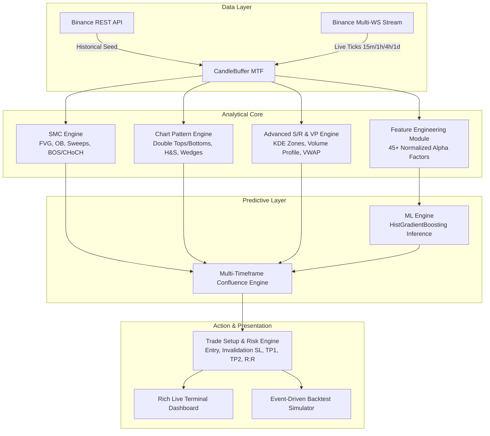
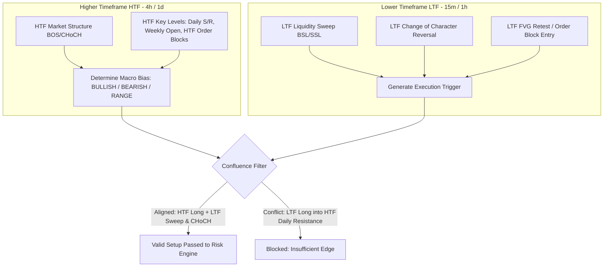
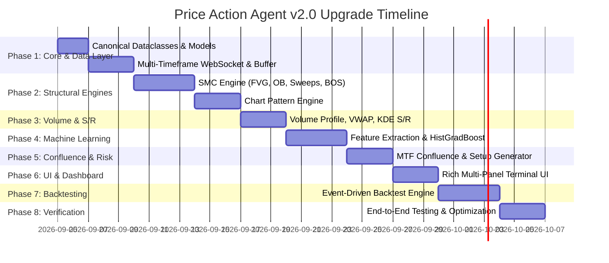

# World-Class Price Action Agent — Architectural Blueprint & System Specification

## 1. Executive Summary & System Vision

### 1.1 Objective
The objective of this architectural blueprint is to transform the existing lightweight, single-timeframe CLI scanner into an institutional-grade, autonomous **Price Action AI Agent**. The upgraded system moves beyond naive single-candle heuristic checks into a robust multi-dimensional analysis platform combining:
1. **Institutional Market Structure & Smart Money Concepts (SMC):** Liquidity sweeps, Order Blocks (OB), Fair Value Gaps (FVG), Break of Structure (BOS), and Change of Character (CHoCH).
2. **Classical & Geometric Chart Patterns:** Algorithmic detection of multi-candle formations (Double Tops/Bottoms, Head & Shoulders, Wedges, Triangles, Flags) with rigorous peak/trough geometry.
3. **Advanced Volume & Statistical Support/Resistance:** Fixed/rolling Volume Profile (POC, VAH, VAL), anchored VWAP with standard deviation bands, Volume Spread Analysis (VSA), and Kernel Density Estimation (KDE) price cluster modeling.
4. **Machine Learning Predictive Scoring:** CPU-optimized Gradient Boosting (`HistGradientBoostingClassifier` / `RandomForestClassifier`) trained on engineered price action and liquidity features to output calibrated directional win probabilities.
5. **Multi-Timeframe (MTF) Confluence:** Synthesis across Higher Timeframe (HTF: 4h, 1d) market context and Lower Timeframe (LTF: 15m, 1h) precision execution triggers.
6. **Institutional Trade Setup & Risk Engine:** Automated generation of high-probability setups with exact Limit/Market Entries, structural Stop Losses, multi-stage Take Profits (TP1, TP2), and strict Risk-to-Reward ($R:R \ge 1:2.0$) filtering.
7. **Real-Time Visual Terminal Cockpit:** A responsive, multi-pane terminal interface built on Python `rich` with live candlestick rendering, level ladders, signal tables, and trade plan cards.
8. **Event-Driven Backtest & Validation Simulator:** A zero-lookahead historical simulation engine benchmarked against real Binance market data to track Win Rate, Profit Factor, Expectancy ($R$), and Maximum Drawdown.

### 1.2 Hardware & Operational Constraints
- **Target Platform:** Windows 10/11, AMD Ryzen 5 5600 (6 cores / 12 threads), 16 GB DDR4 RAM.
- **Hardware Architecture:** **Zero GPU Requirement**. All numerical computations are vectorized using NumPy, SciPy, and Pandas. Machine learning employs scikit-learn's multi-threaded histogram-based gradient boosting (`HistGradientBoostingClassifier`), running inferences in under 1.5 milliseconds per update.
- **Latency & Streaming:** Multi-stream asynchronous WebSocket streaming from Binance with automatic reconnection, heartbeat management, and thread-safe data ring-buffers.

---

## 2. Current State vs. Target State Analysis (Gap Analysis)

| Dimension | Current Implementation (`price_action_engine.py` / `main.py`) | Target Architectural State (`Price Action Agent v2.0`) |
| :--- | :--- | :--- |
| **Timeframe Architecture** | Single timeframe selected at startup; isolated candle series. | **Multi-Timeframe Engine (MTF):** Simultaneous ingestion of HTF (1d, 4h) + LTF (1h, 15m) streams with cross-timeframe alignment. |
| **Market Structure (SMC)** | Fixed 3-bar swing window ($i \pm 2$), simple HH/HL classification. | **Full SMC Suite:** Order Blocks (OB), Fair Value Gaps (FVG) with mitigation tracking, Buy/Sell Liquidity Sweeps, BOS, and CHoCH pivots. |
| **Pattern Recognition** | Single-candle checks (Doji, Hammer, Engulfing, Inside/Outside Bar). | **Geometric & Multi-Candle Engine:** Double Tops/Bottoms, H&S, Wedges, Triangles, Morning/Evening Stars, Fakeys, with mathematical tolerances. |
| **Support & Resistance** | Primitive price clustering within fixed percentage threshold. | **KDE Clustering + Volume Profile (POC/VAH/VAL) + Anchored VWAP + Dynamic Fibonacci:** Density-based attractor zones with volume confirmation. |
| **Volume Analysis** | Simple RVOL comparison against 20 SMA. | **Volume Spread Analysis (VSA):** Absorption, stopping volume, effort vs. result, liquidity pool depletion, and rolling Volume Profiles. |
| **Predictive Modeling** | Static hardcoded weights ($30\%/30\%/20\%/10\%/10\%$) summing to basic score. | **Hybrid Statistical + Machine Learning:** Calibrated `HistGradientBoosting` probability model combined with multi-factor confluence scoring. |
| **Execution & Risk** | Speculative target ($1.5\%$ arbitrary offset or nearest raw level). | **Institutional Setup Generator:** Structural Invalidation Stop Loss, Multi-target Take Profits (TP1 at 50% scale-out, TP2 runner), strict $R:R$ validation. |
| **Terminal Display** | Basic multi-line sequential print via `rich.text`. | **Interactive Multi-Panel Cockpit:** Real-time dashboard layout with live ticker, MTF bias matrix, signal cards, S/R ladder, and trade plan panel. |
| **Verification & Testing** | Single basic unit test file with mock data. | **Event-Driven Backtester:** Walk-forward simulation, slippage & fee modeling, equity curve, Sharpe/Sortino, max drawdown, and Monte Carlo stress tests. |

---

## 3. High-Level Target Architecture & Package Layout

```
Price-Action-agent/
│
├── start.bat                         # One-click Windows launcher with venv check
├── main.py                           # CLI entry point, mode selector (Live, Backtest, Train)
├── config.py                         # Unified configuration, paths, logging, hyperparams
├── requirements.txt                  # Python dependencies
├── README.md                         # User documentation & manual
│
├── docs/                             # Architectural blueprints & engineering specifications
│   └── architecture_plan.md          # Complete system architectural blueprint
│
├── core/                             # Core framework abstractions & data models
│   ├── __init__.py
│   ├── models.py                     # Canonical dataclasses (Candle, Setup, Pattern, SMC, etc.)
│   ├── event_bus.py                  # Thread-safe pub/sub event dispatcher
│   └── logger.py                     # High-performance structured logging
│
├── data/                             # Data ingestion, normalization, and persistence
│   ├── __init__.py
│   ├── binance_client.py             # Multi-stream WebSocket client & REST fallback fetcher
│   ├── candle_buffer.py              # Thread-safe circular ring-buffer for multi-timeframe OHLCV
│   ├── symbol_mapper.py              # Friendly name resolver & fuzzy matching
│   └── storage.py                    # Local Parquet/Feather cache for historical candles
│
├── engines/                          # Modular analytical engines
│   ├── __init__.py
│   ├── smc_engine.py                 # Smart Money Concepts (FVG, OB, Sweeps, BOS, CHoCH)
│   ├── chart_pattern_engine.py       # Geometric & multi-candle chart pattern detection
│   ├── indicators_sr_engine.py       # Volume Profile (POC/VAH/VAL), VWAP, VSA, KDE S/R, Fibo
│   ├── ml_engine.py                  # Feature engineering, model inference & training pipeline
│   ├── confluence_engine.py          # Multi-timeframe confluence scoring & bias synthesis
│   ├── trade_setup_engine.py         # Entry, SL, TP1, TP2, R:R calculation & risk management
│   └── backtest_engine.py            # Event-driven backtesting engine & performance analytics
│
├── ui/                               # Terminal user interface
│   ├── __init__.py
│   ├── dashboard.py                  # Rich Live Terminal Cockpit (multi-panel layout)
│   └── visualizer.py                 # ASCII / Rich mini-charts and S/R depth ladder
│
├── models/                           # Trained ML artifacts & feature encoders
│   └── hgb_price_action_latest.joblib
│
└── tests/                            # Comprehensive automated test suite
    ├── test_smc_engine.py
    ├── test_chart_patterns.py
    ├── test_indicators_sr.py
    ├── test_ml_pipeline.py
    ├── test_confluence_engine.py
    ├── test_trade_setup.py
    └── test_backtester.py
```

### 3.1 Architectural Flow Diagram



---

## 4. Component Deep Dives & Algorithmic Specifications

### 4.1 Smart Money Concepts (SMC) Engine (`engines/smc_engine.py`)

The SMC engine detects institutional footprint patterns that drive institutional liquidity.

#### 1. Fair Value Gaps (FVG)
- **Definition:** A 3-candle price sequence where an aggressive displacement leaves an unfilled gap between Candle 1 and Candle 3.
  - **Bullish FVG:** $\text{Low}(\text{Candle}_{t}) > \text{High}(\text{Candle}_{t-2})$. The imbalance zone is $[\text{High}_{t-2}, \text{Low}_{t}]$.
  - **Bearish FVG:** $\text{High}(\text{Candle}_{t}) < \text{Low}(\text{Candle}_{t-2})$. The imbalance zone is $[\text{High}_{t}, \text{Low}_{t-2}]$.
- **Mitigation Tracking:**
  - *Unmitigated:* Subsequent price action has not entered the zone.
  - *Partially Mitigated:* Price has retested $> 25\%$ of the FVG depth but closed outside.
  - *Mitigated/Invalidated:* Candle body closes beyond the $50\%$ midline (Consequent Encroachment) or fully pierces the zone.
- **Volume Filter:** An FVG is only validated if Candle $t-1$ (the displacement candle) has Relative Volume $\text{RVOL} \ge 1.4$.

#### 2. Order Blocks (OB)
- **Bullish Order Block:** The last down-close (bearish) candle immediately preceding an aggressive upward impulse that successfully produces a Break of Structure (BOS) or Fair Value Gap.
  - Defined by $[ \text{Low}_{\text{candle}}, \max(\text{Open}_{\text{candle}}, \text{Close}_{\text{candle}}) ]$.
- **Bearish Order Block:** The last up-close (bullish) candle immediately preceding an aggressive downward impulse that produces a downward BOS or FVG.
  - Defined by $[ \min(\text{Open}_{\text{candle}}, \text{Close}_{\text{candle}}), \text{High}_{\text{candle}} ]$.
- **Validation:** Minimum $1.5\times$ average range displacement within 2 candles following the OB; tracked until price closes completely through the block (invalidation).

#### 3. Liquidity Sweeps (Stop Hunts)
- **Buy-Side Liquidity (BSL) Sweep:** Price breaches a major swing high / equal highs (BSL pool) by $\ge 0.1\%$, but within 1–2 candles prints a long upper wick and closes back below the swing level.
- **Sell-Side Liquidity (SSL) Sweep:** Price pierces a swing low / equal lows (SSL pool) but rapidly rebounds, leaving a lower wick rejection and closing back above the swing level.
- **Algorithmic Rule:**
  $$\text{Upper Wick} \ge 0.55 \times \text{Range} \quad \text{AND} \quad \text{Close} < \text{Swing High}$$
  $$\text{RVOL} \ge 1.3 \quad \text{(Absorption of stop orders by institutional market makers)}$$

#### 4. Break of Structure (BOS) vs. Change of Character (CHoCH)
- **Swing High/Low Identification:** Dynamic swing points identified via $N$-bar rolling extrema ($N=5$ on LTF, $N=3$ on HTF).
- **BOS (Trend Continuation):**
  - In an established uptrend (HH/HL), a confirmed candle close *above* the most recent Swing High constitutes a Bullish BOS.
  - In a downtrend (LH/LL), a confirmed candle close *below* the most recent Swing Low constitutes a Bearish BOS.
- **CHoCH (Structural Trend Reversal):**
  - In a downtrend, a confirmed candle close *above* the most recent Lower High (LH) signals a Bullish Change of Character (Bearish $\to$ Bullish reversal).
  - In an uptrend, a confirmed candle close *below* the most recent Higher Low (HL) signals a Bearish Change of Character (Bullish $\to$ Bearish reversal).

---

### 4.2 Chart Pattern Engine (`engines/chart_pattern_engine.py`)

Detects classical multi-candle formations using peak/trough extraction, neckline linear regression, and slope convergence analysis.

#### 1. Double Top & Double Bottom
- **Double Top (Bearish Reversal):** Two prominent swing peaks $P_1, P_2$ separated by at least 5 candles and at most 40 candles.
  - Height similarity: $|P_1 - P_2| / \min(P_1, P_2) \le 0.008$ ($0.8\%$ tolerance).
  - Intervening trough $T$ forms the neckline.
  - Invalidation: Price closes above $\max(P_1, P_2)$.
  - Confirmation: Price breaks below neckline $T$.
- **Double Bottom (Bullish Reversal):** Two prominent swing troughs $T_1, T_2$ with price difference $\le 0.8\%$, separated by peak $P$.

#### 2. Head and Shoulders (Standard & Inverse)
- **Standard Head and Shoulders (Bearish):** Three successive peaks where Left Shoulder $S_L < \text{Head} > \text{Right Shoulder } S_R$, with $|S_L - S_R| / S_L \le 0.02$.
  - Neckline established by linear regression through troughs $T_1$ (between $S_L$ and Head) and $T_2$ (between Head and $S_R$).
- **Inverse Head and Shoulders (Bullish):** Central trough lower than both left and right shoulder troughs.

#### 3. Triangles & Wedges
- **Ascending Triangle:** Flat horizontal resistance line (standard deviation of peak prices $< 0.3\%$) coupled with higher swing lows (positive trendline slope $> 0$).
- **Descending Triangle:** Flat horizontal support line coupled with lower swing highs (negative trendline slope $< 0$).
- **Symmetrical Triangle:** Converging upper trendline (negative slope) and lower trendline (positive slope).
- **Rising Wedge (Bearish):** Both upper and lower trendlines have positive slopes, but the lower trendline is steeper (converging upward).
- **Falling Wedge (Bullish):** Both upper and lower trendlines have negative slopes, but the upper trendline is steeper (converging downward).

#### 4. Multi-Candle Formations
- **Morning Star / Evening Star:** 3-candle reversal pattern with large directional bar, small-bodied star gapping in direction of trend, and strong reversal candle penetrating $\ge 50\%$ of the first candle's body.
- **Three White Soldiers / Three Black Crows:** 3 consecutive strong directional bars closing near their extremes with increasing or steady volume.
- **Fakey (False Breakout of Inside Bar):** An Inside Bar is breached on the next candle, but fails and closes back inside the mother bar range.

---

### 4.3 Advanced Indicators & Support/Resistance Engine (`engines/indicators_sr_engine.py`)

Replaces arbitrary point clustering with statistical and institutional volume-profiling methods.

#### 1. Volume Profile (Fixed Window & Rolling Sessions)
- **Discretization:** Price range $[\min(L), \max(H)]$ divided into $B = 70$ uniform price bins.
- **Volume Allocation:** Candle volume allocated to bins based on overlap with the candle's body and wicks (or tick volume if available).
- **Point of Control (POC):** The price bin with the absolute highest traded volume.
- **Value Area (VA):** The price range surrounding the POC containing $70\%$ of the total traded volume over the profile period:
  - **Value Area High (VAH):** Upper boundary of the $70\%$ volume zone.
  - **Value Area Low (VAL):** Lower boundary of the $70\%$ volume zone.
- **Institutional Meaning:** Price inside Value Area indicates market acceptance (mean reversion); price breaking outside indicates imbalance and trend discovery.

#### 2. Anchored VWAP with Standard Deviation Bands
- **Anchored VWAP:**
  $$\text{VWAP}_t = \frac{\sum_{i=1}^t \text{Price}_i \times \text{Volume}_i}{\sum_{i=1}^t \text{Volume}_i} \quad \text{where } \text{Price}_i = \frac{H_i + L_i + C_i}{3}$$
- **Variance Bands:**
  $$\sigma_t = \sqrt{\frac{\sum_{i=1}^t \text{Volume}_i \times (\text{Price}_i - \text{VWAP}_t)^2}{\sum_{i=1}^t \text{Volume}_i}}$$
  Bands calculated at $\text{VWAP} \pm 1\sigma, \pm 2\sigma, \pm 3\sigma$.
- **Signals:** Price reaching $+2\sigma / +3\sigma$ represents statistical overextension; mean-reversion toward VWAP is favored unless accompanied by heavy volume breakout.

#### 3. Kernel Density Estimation (KDE) Support & Resistance
- Instead of naive distance clustering, swing highs and lows are modeled using a continuous Gaussian Kernel Density Estimator via `scipy.stats.gaussian_kde`:
  $$\hat{f}(p) = \frac{1}{n h \sqrt{2\pi}} \sum_{i=1}^n \exp\left( -\frac{(p - p_i)^2}{2 h^2} \right)$$
- Bandwidth $h$ selected using Silverman's rule of thumb adjusted for market volatility ($\text{ATR}_{14}$).
- **Local Maxima:** Points where $\hat{f}'(p) = 0$ and $\hat{f}''(p) < 0$ identify major statistical Support and Resistance price attractors.
- **Significance Score:** Height of density peak $\hat{f}(p)$ directly reflects institutional touch density and order clustering.

#### 4. Dynamic Fibonacci Retracements & Extensions
- Automatically anchored between the most significant swing low and swing high over the active market cycle:
  - Retracement levels: $0.236, 0.382, 0.500, 0.618$ ("Golden Pocket" $0.618 - 0.66$), $0.786$.
  - Extension targets: $-0.272, -0.618, 1.618$.
- Confluence detection: Fibonacci levels intersecting with FVG, Order Blocks, or Volume Profile POC/VAL/VAH receive a heavy confluence score multiplier.

#### 5. Volume Spread Analysis (VSA)
- Evaluates the relationship between candle spread (High - Low), volume, and close position:
  - *Stopping Volume:* Extremely high volume on a wide-spread down-bar closing in the upper half (institutional absorption).
  - *No Demand Bar:* Narrow spread up-bar with volume significantly below the prior 2 candles (lack of buyer commitment).
  - *No Supply Bar:* Narrow spread down-bar with volume significantly below the prior 2 candles (lack of seller commitment).
  - *Effort vs. Result:* High volume resulting in a narrow body near resistance/support signals hidden absorption and imminent reversal.

---

### 4.4 Machine Learning Inference & Training Pipeline (`engines/ml_engine.py`)

A CPU-native, low-latency machine learning engine designed for fast tabular inference.

#### 1. Model Architecture
- **Classifier:** `sklearn.ensemble.HistGradientBoostingClassifier`
  - Highly optimized C-based implementation inspired by LightGBM.
  - Native integer histogram binning of continuous features.
  - Sub-millisecond inference time on CPU ($< 1.5\text{ ms}$).
  - Built-in support for missing values and monotonic constraints.
- **Fallback / Validation Ensemble:** `RandomForestClassifier(n_estimators=100, max_depth=8, n_jobs=-1)`.

#### 2. Feature Vector Engineering (48 Vectorized Features)
Features are computed purely on historical and current closed/forming candle data:
- **Candlestick Geometry:**
  - `body_to_range_ratio`: $|C - O| / (H - L)$
  - `upper_wick_ratio`: $(H - \max(O, C)) / (H - L)$
  - `lower_wick_ratio`: $(\min(O, C) - L) / (H - L)$
  - `bar_direction`: $\text{sign}(C - O)$
  - `consecutive_streak`: count of directional bars
- **Volatility & Moving Averages:**
  - `atr_normalized`: $\text{ATR}_{14} / C$
  - `dist_ema20_pct`: $(C - \text{EMA}_{20}) / \text{EMA}_{20}$
  - `dist_ema50_pct`: $(C - \text{EMA}_{50}) / \text{EMA}_{50}$
  - `dist_ema200_pct`: $(C - \text{EMA}_{200}) / \text{EMA}_{200}$
  - `ema20_slope`: 5-bar gradient of $\text{EMA}_{20}$
- **Volume & Institutional Footprint:**
  - `rvol_20`: $V / \text{SMA}(V, 20)$
  - `volume_zscore`: $(V - \mu_V) / \sigma_V$
  - `vwap_dist_pct`: $(C - \text{VWAP}) / \text{VWAP}$
  - `vwap_sigma_pos`: position in VWAP $\sigma$-bands ($[-3, +3]$)
  - `dist_to_poc_pct`: distance to nearest Volume Profile POC
  - `in_value_area`: binary flag ($1$ if inside $[\text{VAL}, \text{VAH}]$, else $0$)
- **SMC & Structural Features:**
  - `dist_nearest_fvg_pct`: percentage distance to nearest unmitigated FVG
  - `dist_nearest_ob_pct`: percentage distance to nearest active Order Block
  - `sweep_detected`: binary flag ($1$ if BSL or SSL sweep occurred in last 3 bars)
  - `bos_trend_state`: $+1$ (Bullish BOS), $-1$ (Bearish BOS), $0$ (neutral)
  - `choch_detected`: binary flag indicating recent structural shift
- **Oscillators & Momentum:**
  - `rsi_14`: Relative Strength Index ($14$)
  - `rsi_slope`: 3-bar rate of change in RSI
  - `macd_hist_normalized`: MACD histogram normalized by price

#### 3. Labeling Strategy (Triple Barrier Method)
To avoid standard fixed-horizon bias, we implement Marcos López de Prado’s **Triple Barrier Method**:
- **Upper Barrier:** $+2.0 \times \text{ATR}_{14}$ (Take Profit boundary).
- **Lower Barrier:** $-1.0 \times \text{ATR}_{14}$ (Stop Loss boundary).
- **Time Barrier:** $K = 12$ candles forward.
- **Labels:**
  - Class $1$ (**BULLISH WIN**): Upper barrier touched before lower barrier or time expiration.
  - Class $2$ (**BEARISH WIN**): Lower barrier touched before upper barrier (when shorting).
  - Class $0$ (**NEUTRAL / TIMEOUT**): Neither barrier reached or chopped out.

#### 4. Training & Validation Protocol
- **Cross-Validation:** Purged Group TimeSeries Split (`TimeSeriesSplit(n_splits=5)`) to eliminate lookahead bias and prevent autocorrelation leakage between contiguous candles.
- **Model Artifact:** Serialized via `joblib` into `models/hgb_price_action_latest.joblib` with metadata detailing train date, feature schema, and out-of-fold F1-score.

---

### 4.5 Multi-Timeframe (MTF) Confluence Engine (`engines/confluence_engine.py`)

Top-down institutional analysis dictates that Lower Timeframe execution must never conflict with Higher Timeframe structure.



- **HTF Bias Hierarchy:**
  1. `4h` & `1d` establish the **Directional Filter**.
  2. If HTF is `BULLISH`, only Long setups are permissioned, unless LTF exhibits an institutional liquidity sweep of HTF resistance with a confirmed `1h` CHoCH.
  3. If HTF is in a `RANGE`, mean-reversion trades from Value Area extremes (VAL $\to$ VAH or VAH $\to$ VAL) are prioritized.

---

### 4.6 Institutional Risk-Reward & Trade Setup Generator (`engines/trade_setup_engine.py`)

A world-class price action system does not simply output "Bullish 70%"; it produces an **actionable, risk-quantified execution plan**.

#### 1. Setup Types
- **Type A: SMC Pullback & Imbalance Fill:** Trend continuation. Entry at $50\%$ midline (Consequent Encroachment) of unmitigated FVG or inside an active Order Block.
- **Type B: Liquidity Sweep & CHoCH Reversal:** Counter-trend or swing turn. Entry on LTF CHoCH confirmation after high-volume sweep of major swing pool.
- **Type C: Value Area Mean Reversion:** Range market. Entry on rejection of VAL (targeting VAH) or rejection of VAH (targeting VAL).

#### 2. Trade Parameter Calculation
- **Entry Price ($P_{\text{entry}}$):**
  - Limit order at OB boundary or FVG $50\%$ equilibrium level; or
  - Market order on closed candle confirmation of CHoCH / Engulfing bar.
- **Invalidation Stop Loss ($P_{\text{SL}}$):**
  - Must be placed behind structural invalidation:
    - Long: $\min(\text{OB Low}, \text{Sweep Low}) - 0.2 \times \text{ATR}_{14}$
    - Short: $\max(\text{OB High}, \text{Sweep High}) + 0.2 \times \text{ATR}_{14}$
- **Take Profit 1 ($P_{\text{TP1}}$):**
  - First structural liquidity target (nearest opposing swing high/low or Volume Profile POC).
  - Scaled exit: Close $50\%$ position size; automatically advance Stop Loss to Breakeven ($P_{\text{entry}}$).
- **Take Profit 2 ($P_{\text{TP2}}$):**
  - Major HTF target (HTF opposing Order Block, Value Area boundary, or $-0.618$ Fibonacci extension).
  - Runner position: $50\%$ of original trade size trails via previous swing lows/highs.
- **Risk-Reward Ratio ($R:R$):**
  $$R:R_{\text{TP1}} = \frac{|P_{\text{TP1}} - P_{\text{entry}}|}{|P_{\text{entry}} - P_{\text{SL}}|}, \quad R:R_{\text{TP2}} = \frac{|P_{\text{TP2}} - P_{\text{entry}}|}{|P_{\text{entry}} - P_{\text{SL}}|}$$
  $$\text{Effective } R:R = 0.5 \times R:R_{\text{TP1}} + 0.5 \times R:R_{\text{TP2}}$$
- **Filter Gate:** Discard any potential setup with $\text{Effective } R:R < 1.80$. Only execute high-expectancy setups.

---

### 4.7 Real-Time Visual Terminal Dashboard (`ui/dashboard.py` & `ui/visualizer.py`)

Built with Python `rich`, replacing unformatted text output with an institutional-grade, multi-panel live cockpit updated tick-by-tick.

```
┌──────────────────────────────────────────────────────────────────────────────────────────────────┐
│  LIVE PRICE ACTION AGENT v2.0  •  BTCUSDT  •  $64,820.50 (+2.4%)  •  2026-09-04 05:30:15 UTC   │
├───────────────────────────────┬──────────────────────────────────┬───────────────────────────────┤
│  MULTI-TIMEFRAME CONFLUENCE   │  SMART MONEY FOOTPRINT (SMC)     │  STATISTICAL S/R & VOL PROFILE│
├───────────────────────────────┼──────────────────────────────────┼───────────────────────────────┤
│  1D : [BULLISH] Above 50 EMA  │  Active FVG: $64,200 - $64,450   │  VAH: $65,400  [Resistance]   │
│  4H : [BULLISH] Uptrend HH/HL │  Order Block: $63,900 (Bullish)  │  POC: $64,100  [Volume Pivot] │
│  1H : [BULLISH] BOS Confirmed │  Liquidity: SSL Sweep at $63,750 │  VAL: $63,200  [Support]      │
│  15m: [BULLISH] CHoCH Pivot   │  Mitigation: 40% (Active)        │  KDE Cluster: $64,050 (High)  │
│  Overall Bias: STRONG BULLISH │  Imbalance RVOL: 2.1x            │  VWAP: $64,310 (+1.2σ)        │
│  Confluence Score: 88% / 100% │  Structure: Bullish BOS (1h)     │  Fibonacci 0.618: $64,180     │
├───────────────────────────────┴──────────────────────────────────┴───────────────────────────────┤
│  ACTIVE TRADE SETUP PLAN [HIGH PROBABILITY - CONFLUENCE ALIGNED]                                 │
├──────────────────────────────────────────────────────────────────────────────────────────────────┤
│  Type: SMC Pullback + FVG Mitigation (Long)       │ Status: ACTIVE TRIGGER                       │
│  Entry Price: $64,350.00 (Limit at FVG 50%)       │ Invalidation Stop Loss: $63,850.00 (-0.78%)  │
│  Take Profit 1: $65,350.00 (+1.55%) [R:R 2.0]     │ Take Profit 2: $66,200.00 (+2.87%) [R:R 3.7] │
│  Position Sizing Risk: 1.0% Account Equity        │ Effective Blend R:R: 1 : 2.85                │
│  Visual: [SL $63,850] ──── [ENTRY $64,350] ──────────── [TP1 $65,350] ──────────────── [TP2 $66,200]│
├──────────────────────────────────────────────────────────────────────────────────────────────────┤
│  RECENT ACTIVITY & LOGS                                                                          │
│  [05:29:45] 15m Bullish Pin Bar confirmed with 1.8x volume at support $64,250                    │
│  [05:30:00] ML Model Inference: P(Long Win) = 0.74 | Uncertainty = 0.12                         │
│  [05:30:15] Trade Setup Generated: High-confluence Long with 1:2.85 blended R:R                  │
└──────────────────────────────────────────────────────────────────────────────────────────────────┘
```

- **Terminal Widgets:**
  - `HeaderPanel`: Real-time pair ticker, live price, 24h change, connection health.
  - `MTFPanel`: 4-timeframe matrix indicating structural alignment.
  - `SMCPanel`: Current FVG zones, active Order Blocks, sweep events, BOS/CHoCH state.
  - `ProfilePanel`: Real-time Volume Profile ladder showing distance to VAH, POC, VAL.
  - `TradePlanCard`: Highlighted trade setup card with visual entry/SL/TP distance gauge.
  - `ActivityStream`: Low-overhead rolling event log.

---

### 4.8 Event-Driven Backtest Simulation Engine (`engines/backtest_engine.py`)

A quantitative validation harness to rigorously test the Price Action Agent on historical multi-timeframe Binance data.

#### 1. Zero-Lookahead Simulation Mechanics
- Ingests chronological OHLCV candle events.
- Evaluates multi-timeframe buffers statefully at each step.
- Trade entry orders are simulated strictly on the candle *following* the signal (or at limit price strictly within the candle's $[L, H]$ range).
- Intracandle execution path modeled conservative-first: if both SL and TP lie within the same candle, the simulator assumes the Stop Loss was hit first (pessimistic execution).

#### 2. Institutional Trading Friction Model
- **Slippage:** Configurable fixed ($0.02\%$) or volume-dependent slippage model.
- **Exchange Fees:** Binance VIP0 fee tier ($0.04\%$ maker / $0.05\%$ taker).
- **Spread Cost:** Realistic bid-ask spread simulation based on historical ATR.

#### 3. Core Performance Metrics Output
- Total Trades & Trade Distribution (Long vs Short)
- Win Rate ($\%$) and Loss Rate ($\%$)
- Profit Factor: $\sum \text{Gross Profits} / \sum \text{Gross Losses}$
- Expectancy ($R$-multiple per trade): $E = (P_{\text{win}} \times R_{\text{win}}) - (P_{\text{loss}} \times R_{\text{loss}})$
- Maximum Drawdown ($\%$ peak-to-trough) & Recovery Factor
- Sharpe Ratio & Sortino Ratio (downside volatility penalized)
- Average Trade Duration & R:R Realized vs Projected

---

## 5. Canonical Data Models & Interfaces

All inter-engine communication is strictly governed by immutable, strongly typed dataclasses in `core/models.py`.

```python
"""
core/models.py - Canonical Data Models for Price Action Agent v2.0
"""
from dataclasses import dataclass, field
from datetime import datetime
from enum import Enum
from typing import List, Dict, Optional, Tuple, Any

class BiasType(str, Enum):
    STRONG_BULLISH = "STRONG_BULLISH"
    BULLISH = "BULLISH"
    NEUTRAL = "NEUTRAL"
    BEARISH = "BEARISH"
    STRONG_BEARISH = "STRONG_BEARISH"

class SetupType(str, Enum):
    SMC_PULLBACK_FVG = "SMC_PULLBACK_FVG"
    SMC_ORDER_BLOCK = "SMC_ORDER_BLOCK"
    LIQUIDITY_SWEEP_REVERSAL = "LIQUIDITY_SWEEP_REVERSAL"
    CHART_PATTERN_BREAKOUT = "CHART_PATTERN_BREAKOUT"
    VALUE_AREA_MEAN_REVERSION = "VALUE_AREA_MEAN_REVERSION"

@dataclass(frozen=True)
class Candle:
    timestamp: datetime
    open: float
    high: float
    low: float
    close: float
    volume: float
    is_closed: bool
    timeframe: str
    symbol: str

@dataclass
class FairValueGap:
    top: float
    bottom: float
    midpoint: float  # Consequent Encroachment (50%)
    bias: BiasType   # BULLISH (gap up) or BEARISH (gap down)
    created_time: datetime
    is_mitigated: bool = False
    mitigation_pct: float = 0.0
    volume_delta: float = 0.0

@dataclass
class OrderBlock:
    top: float
    bottom: float
    bias: BiasType
    created_time: datetime
    volume: float
    is_mitigated: bool = False
    is_invalidated: bool = False

@dataclass
class LiquiditySweep:
    level_breached: float
    sweep_type: str  # "BUY_SIDE" (BSL) or "SELL_SIDE" (SSL)
    wick_rejection_pct: float
    volume_ratio: float
    timestamp: datetime

@dataclass
class MarketStructureState:
    trend: str               # "UPTREND", "DOWNTREND", "RANGE"
    recent_bos: Optional[str] # "BULLISH_BOS", "BEARISH_BOS"
    recent_choch: Optional[str] # "BULLISH_CHOCH", "BEARISH_CHOCH"
    last_swing_high: float
    last_swing_low: float

@dataclass
class ChartPattern:
    name: str                # e.g., "DOUBLE_BOTTOM", "HEAD_AND_SHOULDERS", "FALLING_WEDGE"
    bias: BiasType
    quality_score: float     # 0.0 to 1.0
    neckline_price: Optional[float]
    projected_target: Optional[float]
    invalidation_level: float
    candle_span: int

@dataclass
class VolumeProfileZone:
    poc_price: float         # Point of Control
    vah_price: float         # Value Area High
    val_price: float         # Value Area Low
    total_volume: float
    hvn_levels: List[float]  # High Volume Nodes
    lvn_levels: List[float]  # Low Volume Nodes

@dataclass
class KDELevel:
    price: float
    density: float
    level_type: str          # "SUPPORT" or "RESISTANCE"
    touches: int

@dataclass
class MLInferenceResult:
    prob_bullish: float      # Model probability of hitting +2R before -1R
    prob_bearish: float
    prob_neutral: float
    model_confidence: float  # Margin over uniform distribution
    feature_contributions: Dict[str, float]

@dataclass
class TimeframeConfluence:
    timeframe: str
    bias: BiasType
    score: float             # -1.0 (max bearish) to +1.0 (max bullish)
    key_signals: List[str]

@dataclass
class ConfluenceReport:
    symbol: str
    timestamp: datetime
    current_price: float
    overall_bias: BiasType
    confidence_score: int    # 0 to 100%
    htf_bias: BiasType
    ltf_trigger: BiasType
    timeframe_breakdown: Dict[str, TimeframeConfluence]
    smc_state: MarketStructureState
    active_patterns: List[ChartPattern]
    active_fvgs: List[FairValueGap]
    active_obs: List[OrderBlock]
    volume_profile: VolumeProfileZone
    ml_prediction: Optional[MLInferenceResult]

@dataclass
class TradeSetup:
    setup_id: str
    symbol: str
    timestamp: datetime
    setup_type: SetupType
    direction: str           # "LONG" or "SHORT"
    entry_price: float
    stop_loss: float
    tp1_price: float
    tp2_price: float
    risk_reward_tp1: float
    risk_reward_tp2: float
    effective_rr: float
    confidence_score: int
    rationale: List[str]
    invalidation_reason: str
```

---

## 6. Confidence Weighting & Confluence Scoring Mathematical Formulation

The system synthesizes disparate structural, statistical, pattern-based, and machine learning signals into a unified **Confidence Score** ($\mathcal{C} \in [0, 100]$).

### 6.1 Multi-Factor Weighted Vector Formulation
Let the raw signal vector be $\mathbf{S} = [S_{\text{SMC}}, S_{\text{HTF}}, S_{\text{SR\_VP}}, S_{\text{PAT}}, S_{\text{ML}}, S_{\text{VOL\_MOM}}]^T$ where each component is normalized to the continuous interval $[-1.0, +1.0]$:
- $+1.0$: Absolute Bullish conviction
- $0.0$: Pure Neutral / Indecision
- $-1.0$: Absolute Bearish conviction

The weight vector $\mathbf{W}$ is defined such that $\sum_{i=1}^6 W_i = 1.0$:

$$\mathbf{W} = \begin{bmatrix}
W_{\text{SMC}} \\
W_{\text{HTF}} \\
W_{\text{SR\_VP}} \\
W_{\text{PAT}} \\
W_{\text{ML}} \\
W_{\text{VOL\_MOM}}
\end{bmatrix} = \begin{bmatrix}
0.25 \\
0.20 \\
0.15 \\
0.15 \\
0.15 \\
0.10
\end{bmatrix}$$

The base raw confluence score $S_{\text{raw}}$ is computed as the inner product:
$$S_{\text{raw}} = \mathbf{W}^T \mathbf{S} = \sum_{i=1}^6 W_i S_i \quad \in [-1.0, +1.0]$$

### 6.2 Component Signal Definitions

1. **Smart Money Concepts ($S_{\text{SMC}}$):**
   $$S_{\text{SMC}} = 0.35 \cdot I_{\text{BOS/CHoCH}} + 0.30 \cdot I_{\text{OB\_Touch}} + 0.25 \cdot I_{\text{FVG\_Consequent}} + 0.10 \cdot I_{\text{Sweep}}$$
   where $I \in \{-1, 0, 1\}$ indicates the directional presence of the structural feature.

2. **Higher Timeframe Alignment ($S_{\text{HTF}}$):**
   $$S_{\text{HTF}} = 0.60 \cdot \text{Bias}_{4h} + 0.40 \cdot \text{Bias}_{1d}$$
   where $\text{Bias} \in \{-1.0, +1.0\}$ based on HTF swing structure and position relative to the 50/200 EMA.

3. **Support/Resistance & Volume Profile ($S_{\text{SR\_VP}}$):**
   $$S_{\text{SR\_VP}} = \begin{cases}
   +0.80 & \text{if price bounces from VAL or POC with positive delta} \\
   -0.80 & \text{if price rejects VAH or POC with negative delta} \\
   \text{clamp}\left(\frac{\text{dist}(\text{Support}) - \text{dist}(\text{Resistance})}{\text{Range}}, -1, 1\right) & \text{otherwise}
   \end{cases}$$

4. **Chart Patterns ($S_{\text{PAT}}$):**
   $$S_{\text{PAT}} = \sum_{k} \text{Quality}_k \times \text{Direction}_k \quad (\text{clamped to } [-1.0, 1.0])$$

5. **Machine Learning Probability ($S_{\text{ML}}$):**
   $$S_{\text{ML}} = P(\text{Bullish Win}) - P(\text{Bearish Win}) \quad \in [-1.0, +1.0]$$

6. **Volume & Momentum Verification ($S_{\text{VOL\_MOM}}$):**
   $$S_{\text{VOL\_MOM}} = \tanh\left( \frac{\text{RVOL} - 1.0}{1.5} \right) \times \text{sign}(\text{Momentum})$$

### 6.3 Dynamic Penalty & Booster Multipliers

The magnitude of the raw score is adjusted by market context penalties and boosters:

$$\mathcal{M} = \prod_{j} M_j$$

1. **Forming (Unclosed) Candle Uncertainty Penalty ($M_{\text{forming}}$):**
   $$M_{\text{forming}} = \begin{cases} 1.0 & \text{if candle is closed} \\ 0.88 & \text{if candle is live/forming} \end{cases}$$

2. **HTF Counter-Trend Penalty ($M_{\text{HTF\_conflict}}$):**
   $$M_{\text{HTF\_conflict}} = \begin{cases} 0.50 & \text{if } \text{sign}(S_{\text{raw}}) \neq \text{sign}(S_{\text{HTF}}) \text{ and } |S_{\text{HTF}}| \ge 0.5 \\ 1.0 & \text{otherwise} \end{cases}$$

3. **Multi-Signal Confluence Booster ($M_{\text{confluence}}$):**
   If at least 4 out of 6 components strictly agree on direction ($\text{sign}(S_i) = \text{sign}(S_{\text{raw}})$):
   $$M_{\text{confluence}} = 1.15$$

4. **Mitigation Decay ($M_{\text{mitigation}}$):**
   If entry relies on an FVG or Order Block that has already been tested twice:
   $$M_{\text{mitigation}} = 0.70$$

### 6.4 Final Confidence Score Computation

$$\mathcal{S}_{\text{adjusted}} = \text{clamp}(S_{\text{raw}} \times \mathcal{M}, -1.0, +1.0)$$

$$\text{Confidence (\%)} = \text{int}\left( 50 + 45 \times |\mathcal{S}_{\text{adjusted}}| \right)$$

$$\text{Final Bias} = \begin{cases}
\text{STRONG\_BULLISH} & \text{if } \mathcal{S}_{\text{adjusted}} \ge +0.65 \\
\text{BULLISH}        & \text{if } +0.15 \le \mathcal{S}_{\text{adjusted}} < +0.65 \\
\text{NEUTRAL}        & \text{if } -0.15 < \mathcal{S}_{\text{adjusted}} < +0.15 \\
\text{BEARISH}        & \text{if } -0.65 < \mathcal{S}_{\text{adjusted}} \le -0.15 \\
\text{STRONG\_BEARISH}& \text{if } \mathcal{S}_{\text{adjusted}} \le -0.65
\end{cases}$$

---

## 7. Implementation Roadmap & Phased Execution Plan



### Phase 1: Core Architecture & Data Engine
- Implement `core/models.py` with all canonical dataclasses and enums.
- Refactor `binance_client.py` to support multi-stream multiplexed WebSockets (`<symbol>@kline_15m`, `1h`, `4h`, `1d`).
- Implement `data/candle_buffer.py` providing a thread-safe multi-timeframe rolling window with zero-copy pandas views.

### Phase 2: SMC & Chart Pattern Recognition
- Build `engines/smc_engine.py`:
  - Vectorized FVG detection and mitigation state machine.
  - Order Block identification linked with impulse breakouts.
  - External liquidity sweep algorithms (BSL/SSL) with wick rejection filters.
  - Confirmed BOS and CHoCH structural state tracker.
- Build `engines/chart_pattern_engine.py`:
  - Double Top/Bottom, Head & Shoulders, Wedges, and Triangles using SciPy extrema and linear regression necklines.

### Phase 3: Advanced S/R, Volume Profile & KDE
- Build `engines/indicators_sr_engine.py`:
  - Fixed & session Volume Profile producing POC, VAH, and VAL.
  - Anchored VWAP with $\pm 1\sigma, \pm 2\sigma, \pm 3\sigma$ dispersion bands.
  - Gaussian KDE Support/Resistance density modeling via `scipy.stats.gaussian_kde`.
  - Auto-anchoring Fibonacci retracement & extension zones.

### Phase 4: Machine Learning Inference & Training Pipeline
- Build `engines/ml_engine.py`:
  - Feature extraction pipeline producing 48 standardized alpha features.
  - Triple Barrier labeling script (`train_model.py`) executing Purged Walk-Forward cross-validation.
  - `HistGradientBoostingClassifier` training with model serialization to `models/hgb_price_action_latest.joblib`.
  - Sub-millisecond live inference method.

### Phase 5: Confluence Synthesis & Institutional Setup Generator
- Build `engines/confluence_engine.py`:
  - Multi-timeframe confluence matrix synthesizing HTF (4h/1d) bias with LTF (15m/1h) triggers.
  - Mathematical confidence weighting and dynamic penalty/booster logic.
- Build `engines/trade_setup_engine.py`:
  - High-expectancy trade setup generation (Entry, structural SL, TP1, TP2, position sizing).
  - Strict $R:R \ge 1.8$ gatekeeper filter.

### Phase 6: Rich Live Terminal Dashboard
- Build `ui/dashboard.py` and `ui/visualizer.py`:
  - Multi-pane live terminal layout powered by `rich.live.Live` and `rich.layout.Layout`.
  - Real-time widgets: Market Banner, MTF Matrix, SMC Footprint, S/R Ladder, Active Trade Card, and Activity Log.

### Phase 7: Event-Driven Backtesting & Simulation
- Build `engines/backtest_engine.py`:
  - Zero-lookahead historical bar-by-bar simulation engine.
  - Slippage, maker/taker fee tier, and conservative intracandle execution modeling.
  - Statistical output: Win Rate, Profit Factor, Expectancy, Max Drawdown, Sharpe/Sortino.

### Phase 8: Verification, Documentation & Integration
- Write comprehensive unit tests in `tests/` covering every engine.
- Update `main.py` to seamlessly orchestrate Live Scanning, Backtesting, and Model Training modes.
- Update `README.md` and `start.bat` for turnkey execution.

---

## 8. Summary of Architectural Deliverables

By executing this blueprint, the Price Action Scanner evolves from a simple single-candle script into an **autonomous, institutional-grade Price Action AI Agent**:
1. **Mathematical & Structural Precision:** Combines Smart Money Concepts with Volume Profile and KDE density modeling.
2. **Multi-Timeframe Grounding:** Eliminates low-timeframe false breakouts by enforcing strict HTF macro bias alignment.
3. **Machine Learning Augmented:** Augments deterministic price action rules with probabilistic Machine Learning edge.
4. **Actionable Risk Management:** Translates market analysis directly into institutional execution plans with exact Stop Loss invalidation and scaled Take Profits.
5. **CPU Optimized & Resilient:** Requires no GPU, runs lightning-fast on standard commodity hardware, and features automatic reconnection and resilient error handling.
