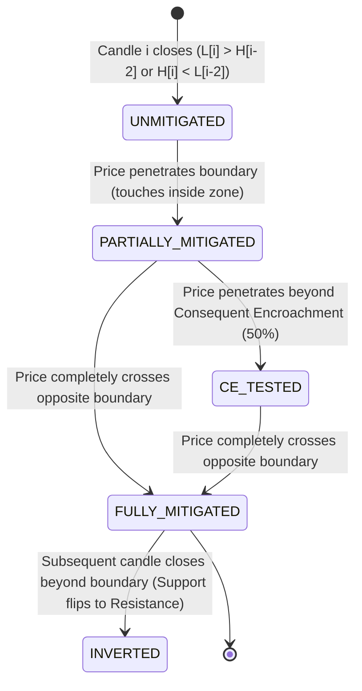

# Smart Money Concepts (SMC) & Market Structure Specification
**Document Version:** 1.0.0  
**Target System:** Live Price Action Scanner & Quant Engine  
**Author:** Subagent 2 — SMC & Market Structure Researcher  
**Last Updated:** 2026-09-04  

---

## 1. Executive Summary & Mathematical Foundations

### 1.1 Overview
Smart Money Concepts (SMC) is a systematic price action framework derived from institutional order flow mechanics and market microstructure principles. In contrast to retail technical analysis relying on lagging indicators (e.g., RSI, MACD), SMC formalizes:
1. **Asymmetric Auction Imbalances:** Areas where buying or selling pressure exhausted opposite limit orders without dual-sided matching (Fair Value Gaps).
2. **Institutional Footprints:** Specific high-displacement candle zones representing large capital accumulation/distribution (Order Blocks).
3. **Liquidity Harvesting:** Exploitation of concentrated resting stop orders beyond key pivot levels before directional continuation (Buy-Side & Sell-Side Liquidity Sweeps).
4. **Structural Geometry:** Directional continuity and inflection state transitions based on confirmed swing point breaches (Break of Structure & Change of Character).

This specification establishes the formal mathematical definitions, state machines, data structures, and production-ready Python algorithms to implement SMC seamlessly within both historical backtesters and real-time streaming engines.

---

### 1.2 Mathematical Notation & Coordinate Conventions

We define a discrete time series of financial price intervals (candlesticks) $\mathcal{C} = \{c_0, c_1, \dots, c_N\}$. Each candle $c_i$ at index $i \in [0, N]$ is a tuple:
$$c_i = \left( t_i, O_i, H_i, L_i, C_i, V_i, x_i \right)$$
where:
- $t_i \in \mathbb{R}^+$ is the Unix timestamp (or ISO-8601 string) of candle open.
- $O_i \in \mathbb{R}^+$ is the open price.
- $H_i \in \mathbb{R}^+$ is the high price ($H_i \ge \max(O_i, C_i, L_i)$).
- $L_i \in \mathbb{R}^+$ is the low price ($L_i \le \min(O_i, C_i, H_i)$).
- $C_i \in \mathbb{R}^+$ is the close price (or last mark price if candle is forming).
- $V_i \in \mathbb{R}^+$ is the executed trading volume.
- $x_i \in \{0, 1\}$ is the boolean completion flag ($x_i = 1$ indicates candle closed; $x_i = 0$ indicates live forming candle).

#### Derivative Properties per Candle
- **Total Range:** $R_i = H_i - L_i$ (where $R_i \ge \epsilon > 0$).
- **Body Range:** $B_i = |C_i - O_i|$.
- **Upper Wick:** $U_i = H_i - \max(O_i, C_i)$.
- **Lower Wick:** $W_i = \min(O_i, C_i) - L_i$.
- **Polarity:** $\text{sgn}_i = \begin{cases} +1 & \text{if } C_i > O_i \text{ (Bullish)} \\ -1 & \text{if } C_i < O_i \text{ (Bearish)} \\ 0 & \text{if } C_i = O_i \text{ (Neutral/Doji)} \end{cases}$
- **Average True Range (ATR):**
  $$\text{TR}_i = \max\left( H_i - L_i, |H_i - C_{i-1}|, |L_i - C_{i-1}| \right)$$
  $$\text{ATR}_{i, K} = \frac{1}{K} \sum_{j=0}^{K-1} \text{TR}_{i-j} \quad \text{or Wilder's EMA equivalent.}$$

#### Lookahead Bias Constraint
For any causal indicator at index $t$, the calculation function $\mathcal{F}(t)$ may **only** access $\{c_j \mid j \le t\}$. When identifying swing fractals requiring lookahead $R$, the signal for pivot at index $k$ can only be emitted at time index $t = k + R$.

---

## 2. Fair Value Gaps (FVG) / Imbalances

### 2.1 Theoretical Foundation: BISI vs SIBI
A Fair Value Gap occurs during violent, one-sided price expansion where price advances or drops so rapidly that liquidity is only offered on one side of the market order book.
- **BISI (Buyside Imbalance Sellside Inefficiency):** Created during an aggressive upward expansion. Only buy market orders are being executed against resting limit asks; resting bids are bypassed, leaving a structural void where subsequent sell orders were never filled.
- **SIBI (Sellside Imbalance Buyside Inefficiency):** Created during an aggressive downward expansion. Only sell market orders hit resting limit bids; buy orders were never accommodated within the void.

```
       BULLISH FVG (BISI)                     BEARISH FVG (SIBI)
      [Candle i-2, i-1, i]                   [Candle i-2, i-1, i]

    i-2        i-1         i               i-2        i-1         i
    ┌─┐        ┌─┐        ┌─┐              ┌─┐        ┌─┐        ┌─┐
    │ │        │ │        │ │              │ │        │ │        │ │
    └─┘        │ │        └┬┘              └┬┘        │ │        └─┘
    High[i-2]  │ │   Low[i]│               │Low[i-2]  │ │  High[i]
   ─────┬──────│ │───────-─┴─             ──┴─────────│ │───────┬───
        │ GAP  │ │                                GAP │ │       │
   ─────┴──────│ │───────────             ────────────│ │───────┴───
               └─┘                                    └─┘
```

---

### 2.2 Formal Mathematical Formulations

#### 2.2.1 Bullish FVG (BISI)
A Bullish FVG is formed over three consecutive closed candles $\{c_{i-2}, c_{i-1}, c_i\}$ if and only if:
$$L_i > H_{i-2}$$

The raw gap boundaries are:
$$\text{Top}_{\text{FVG}} = L_i$$
$$\text{Bottom}_{\text{FVG}} = H_{i-2}$$
$$\text{Gap Size } \Delta_{\text{FVG}} = L_i - H_{i-2} > 0$$

#### 2.2.2 Bearish FVG (SIBI)
A Bearish FVG is formed over three consecutive closed candles $\{c_{i-2}, c_{i-1}, c_i\}$ if and only if:
$$H_i < L_{i-2}$$

The raw gap boundaries are:
$$\text{Top}_{\text{FVG}} = L_{i-2}$$
$$\text{Bottom}_{\text{FVG}} = H_i$$
$$\text{Gap Size } \Delta_{\text{FVG}} = L_{i-2} - H_i > 0$$

#### 2.2.3 Significance & Volatility Filters
To eliminate market microstructure noise and sub-tick spread anomalies, a candidate gap must exceed a minimum volatility threshold:
$$\Delta_{\text{FVG}} \ge \kappa_{\text{fvg}} \cdot \text{ATR}_{i, 14}$$
where $\kappa_{\text{fvg}} \in [0.10, 0.50]$ (default: $0.20$). Alternatively, in percentage terms:
$$\frac{\Delta_{\text{FVG}}}{C_i} \ge \tau_{\min} \quad (\text{e.g., } \tau_{\min} = 0.0005 \text{ or } 0.05\%)$$

#### 2.2.4 Consequent Encroachment (CE)
The institutional mean equilibrium price of an FVG is known as the **Consequent Encroachment (CE)**:
$$\text{CE} = \frac{\text{Top}_{\text{FVG}} + \text{Bottom}_{\text{FVG}}}{2}$$
- In a Bullish FVG, institutional algorithms often target $\text{CE}$ to refill liquidity without invalidating the bullish order flow.
- A body close violating $\text{CE}$ signals structural weakness of the imbalance.

---

### 2.3 Dynamic Mitigation Tracking & Life Cycle

An active FVG undergoes state transitions across subsequent bars $t > i$:



#### Exact Mitigation Math per Time Step $t > i$:
Let the active gap zone be $[B, T]$ where $B = \text{Bottom}_{\text{FVG}}$ and $T = \text{Top}_{\text{FVG}}$.

1. **Bullish FVG Mitigation ($L_i > H_{i-2}$):**
   - **Entry Condition:** $L_t < T$.
   - **Remaining Unmitigated Gap:** If $L_t < T$, the top of the unmitigated void contracts dynamically:
     $$T_t = \min(T_{t-1}, L_t)$$
   - **Mitigation Depth Ratio:**
     $$\rho_t = \frac{T_0 - \min(T_t, B)}{T_0 - B} \in [0.0, 1.0]$$
   - **State Evaluation:**
     - If $L_t \le B \implies \text{State} = \text{FULLY\_MITIGATED}$ ($\rho_t = 1.0$).
     - Else if $L_t \le \text{CE} \implies \text{State} = \text{CE\_TESTED}$.
     - Else if $L_t < T_0 \implies \text{State} = \text{PARTIALLY\_MITIGATED}$.
     - Else $\implies \text{State} = \text{UNMITIGATED}$.

2. **Bearish FVG Mitigation ($H_i < L_{i-2}$):**
   - **Entry Condition:** $H_t > B$.
   - **Remaining Unmitigated Gap:**
     $$B_t = \max(B_{t-1}, H_t)$$
   - **Mitigation Depth Ratio:**
     $$\rho_t = \frac{\max(B_t, T) - B_0}{T - B_0} \in [0.0, 1.0]$$
   - **State Evaluation:**
     - If $H_t \ge T \implies \text{State} = \text{FULLY\_MITIGATED}$ ($\rho_t = 1.0$).
     - Else if $H_t \ge \text{CE} \implies \text{State} = \text{CE\_TESTED}$.
     - Else if $H_t > B_0 \implies \text{State} = \text{PARTIALLY\_MITIGATED}$.
     - Else $\implies \text{State} = \text{UNMITIGATED}$.

3. **Inversion FVG (IFVG):**
   - When a Bullish FVG is violated by a candle *closing* below $B$ ($C_t < B$), the zone is not deleted; its role inverts to a Bearish Inversion FVG (acting as overhead supply/resistance upon retest).
   - Conversely, when a Bearish FVG is violated with $C_t > T$, it inverts to a Bullish Inversion FVG (acting as demand/support).

---

### 2.4 FVG Python Specification & Reference Algorithm

```python
from dataclasses import dataclass, field
from enum import Enum
from typing import List, Optional, Tuple, Dict, Any
import numpy as np
import pandas as pd

class FVGType(Enum):
    BULLISH = "BULLISH"  # BISI
    BEARISH = "BEARISH"  # SIBI

class FVGState(Enum):
    UNMITIGATED = "UNMITIGATED"
    PARTIALLY_MITIGATED = "PARTIALLY_MITIGATED"
    CE_TESTED = "CE_TESTED"
    FULLY_MITIGATED = "FULLY_MITIGATED"
    INVERTED = "INVERTED"

@dataclass
class FairValueGap:
    gap_type: FVGType
    creation_index: int
    creation_timestamp: Any
    top: float
    bottom: float
    ce: float                      # Consequent Encroachment (50% midpoint)
    initial_size: float
    current_top: float             # Dynamic remaining gap top
    current_bottom: float          # Dynamic remaining gap bottom
    state: FVGState = FVGState.UNMITIGATED
    mitigation_index: Optional[int] = None
    mitigation_percentage: float = 0.0
    is_inverted: bool = False

    @property
    def is_active(self) -> bool:
        return self.state in [FVGState.UNMITIGATED, FVGState.PARTIALLY_MITIGATED, FVGState.CE_TESTED]

class FVGDetector:
    """
    Robust Fair Value Gap (FVG) Detector and Real-time Mitigation Tracker.
    """
    def __init__(self, min_atr_mult: float = 0.20, atr_period: int = 14):
        self.min_atr_mult = min_atr_mult
        self.atr_period = atr_period
        self.fvgs: List[FairValueGap] = []

    def detect_and_update(self, df: pd.DataFrame) -> List[FairValueGap]:
        """
        Scans OHLCV dataframe, detects new 3-bar FVGs on confirmed candles,
        and dynamically updates mitigation status against subsequent price bars.
        """
        if len(df) < 3:
            return []

        # 1. Compute ATR for dynamic volatility threshold
        high = df['high'].values
        low = df['low'].values
        close = df['close'].values
        n = len(df)

        tr = np.maximum(high[1:] - low[1:], 
                        np.maximum(np.abs(high[1:] - close[:-1]), 
                                   np.abs(low[1:] - close[:-1])))
        tr = np.insert(tr, 0, high[0] - low[0])
        atr = pd.Series(tr).rolling(window=self.atr_period, min_periods=1).mean().values

        self.fvgs.clear()

        # 2. Iterate through candles to find 3-candle patterns
        for i in range(2, n):
            # Check for completed candle at i
            # Condition: Bullish FVG (Low[i] > High[i-2])
            atr_thresh = self.min_atr_mult * atr[i]
            
            if low[i] > high[i-2]:
                gap_size = low[i] - high[i-2]
                if gap_size >= atr_thresh:
                    top = float(low[i])
                    bottom = float(high[i-2])
                    ce = (top + bottom) / 2.0
                    fvg = FairValueGap(
                        gap_type=FVGType.BULLISH,
                        creation_index=i,
                        creation_timestamp=df['timestamp'].iloc[i] if 'timestamp' in df.columns else i,
                        top=top,
                        bottom=bottom,
                        ce=ce,
                        initial_size=gap_size,
                        current_top=top,
                        current_bottom=bottom
                    )
                    self.fvgs.append(fvg)

            # Condition: Bearish FVG (High[i] < Low[i-2])
            elif high[i] < low[i-2]:
                gap_size = low[i-2] - high[i]
                if gap_size >= atr_thresh:
                    top = float(low[i-2])
                    bottom = float(high[i])
                    ce = (top + bottom) / 2.0
                    fvg = FairValueGap(
                        gap_type=FVGType.BEARISH,
                        creation_index=i,
                        creation_timestamp=df['timestamp'].iloc[i] if 'timestamp' in df.columns else i,
                        top=top,
                        bottom=bottom,
                        ce=ce,
                        initial_size=gap_size,
                        current_top=top,
                        current_bottom=bottom
                    )
                    self.fvgs.append(fvg)

        # 3. Track mitigation forward in time
        for fvg in self.fvgs:
            start_k = fvg.creation_index + 1
            for k in range(start_k, n):
                bar_h = high[k]
                bar_l = low[k]
                bar_c = close[k]

                if fvg.gap_type == FVGType.BULLISH:
                    if bar_l < fvg.current_top:
                        # Price entered gap
                        fvg.current_top = min(fvg.current_top, bar_l)
                        penetration = (fvg.top - max(fvg.current_top, fvg.bottom))
                        fvg.mitigation_percentage = min(1.0, max(0.0, penetration / fvg.initial_size))

                        if bar_l <= fvg.bottom:
                            fvg.state = FVGState.FULLY_MITIGATED
                            fvg.mitigation_index = k
                            fvg.mitigation_percentage = 1.0
                            # Check for inversion (close below bottom)
                            if bar_c < fvg.bottom:
                                fvg.is_inverted = True
                                fvg.state = FVGState.INVERTED
                            break
                        elif bar_l <= fvg.ce:
                            fvg.state = FVGState.CE_TESTED
                        else:
                            fvg.state = FVGState.PARTIALLY_MITIGATED

                elif fvg.gap_type == FVGType.BEARISH:
                    if bar_h > fvg.current_bottom:
                        # Price entered gap
                        fvg.current_bottom = max(fvg.current_bottom, bar_h)
                        penetration = (min(fvg.current_bottom, fvg.top) - fvg.bottom)
                        fvg.mitigation_percentage = min(1.0, max(0.0, penetration / fvg.initial_size))

                        if bar_h >= fvg.top:
                            fvg.state = FVGState.FULLY_MITIGATED
                            fvg.mitigation_index = k
                            fvg.mitigation_percentage = 1.0
                            # Check for inversion (close above top)
                            if bar_c > fvg.top:
                                fvg.is_inverted = True
                                fvg.state = FVGState.INVERTED
                            break
                        elif bar_h >= fvg.ce:
                            fvg.state = FVGState.CE_TESTED
                        else:
                            fvg.state = FVGState.PARTIALLY_MITIGATED

        return self.fvgs
```

---

## 3. Order Blocks (OB)

### 3.1 Definition & Institutional Mechanics
An **Order Block (OB)** represents the footprint of institutional order placement before a major directional price movement. When institutions accumulate a massive long position, they must execute against sell limit and stop orders, frequently driving price downward into support right before violently shifting price upward.
- **Bullish Order Block (+OB):** The last down-close candle (or continuous cluster of down candles) immediately preceding a powerful, impulsive bullish displacement that breaches structure.
- **Bearish Order Block (-OB):** The last up-close candle (or continuous cluster of up candles) immediately preceding a powerful, impulsive bearish displacement that breaches structure.

```
       BULLISH ORDER BLOCK (+OB)                  BEARISH ORDER BLOCK (-OB)
      
          Impulsive Displacement                    Last Up Candle (-OB)
          creates BOS + FVG                          ┌─┐ High
                  ┌─┐                                ┌┴┐ │
                  │ │                                │ │─┴─ Mean Threshold (50%)
                  │ │                                └┬┘ │
                  │ │                                 │  Low
                  └┬┘                                 │  
                   │  Low[i+1] > High[i-1]            │  Impulsive Expansion Down
        ┌─┐        │                                 ┌┴┐ creates BOS + FVG
        │ │        │                                 │ │
        └┬┘        │                                 │ │
      ───┴─────────┴───── +OB Top                    └─┘
     [Last Down Candle]
      ───┬─────────────── +OB Bottom (Invalidation)
        ┌┴┐
        └─┘
```

---

### 3.2 Strict 4-Pillar Validation Criteria

Not every opposite-color candle is an Order Block. In quantitative SMC, a candidate candle at index $j$ is strictly classified as an active Order Block if and only if all four mathematical criteria are satisfied within a horizon of $M$ bars ($M \in [1, 4]$, typically $M = 3$):

$$\text{OB}(j) \iff \text{Pillar}_1 \land \text{Pillar}_2 \land \text{Pillar}_3 \land \text{Pillar}_4$$

#### Pillar 1: Candle Polarity Preceding Displacement
- Bullish OB: Candle $j$ must have $C_j < O_j$ (bearish close).
- Bearish OB: Candle $j$ must have $C_j > O_j$ (bullish close).
*(Note: In institutional practice, if candle $j$ was a narrow inside bar or doji, the true OB is the preceding candle $j-1$ with dominant opposite polarity).*

#### Pillar 2: Impulsive Displacement (Displacement Factor)
The subsequent directional move from $j+1$ to $j+M$ must exhibit abnormal velocity and expansion:
$$\text{Displacement Range: } D_{j, M} = \begin{cases} \max_{k \in [1, M]} (H_{j+k}) - L_j & (\text{Bullish}) \\ H_j - \min_{k \in [1, M]} (L_{j+k}) & (\text{Bearish}) \end{cases}$$
Validation rule:
$$D_{j, M} \ge \alpha_{\text{disp}} \cdot \text{ATR}_{j, 14} \quad (\text{with } \alpha_{\text{disp}} \ge 1.50)$$
Furthermore, the expansion candle $j+1$ must have a high body-to-range ratio:
$$\frac{|C_{j+1} - O_{j+1}|}{H_{j+1} - L_{j+1}} \ge 0.60 \quad \text{(Marubozu / Expansion profile)}$$

#### Pillar 3: Fair Value Gap Creation (Imbalance Footprint)
True institutional accumulation creates market inefficiency. Therefore:
$$\exists k \in [1, M] \text{ such that an unmitigated FVG is formed in the direction of displacement.}$$
For a Bullish OB, $L_{j+2} > H_j$. For a Bearish OB, $H_{j+2} < L_j$.

#### Pillar 4: Structural Break Confirmation (BOS or CHoCH)
The impulsive displacement must decisively violate a recent swing point (see Section 5):
$$\text{Bullish OB: } \exists k \in [1, M] \text{ where } C_{j+k} > \text{LastSwingHigh}$$
$$\text{Bearish OB: } \exists k \in [1, M] \text{ where } C_{j+k} < \text{LastSwingLow}$$

---

### 3.3 Zone Delineation & Reference Levels

An Order Block has three standard boundary conventions:

| Zone Convention | Bullish OB Top | Bullish OB Bottom | Bearish OB Top | Bearish OB Bottom |
| :--- | :--- | :--- | :--- | :--- |
| **Extreme (Wick-to-Wick)** | $H_j$ | $L_j$ | $H_j$ | $L_j$ |
| **Conservative (Body Only)** | $\max(O_j, C_j)$ | $\min(O_j, C_j)$ | $\max(O_j, C_j)$ | $\min(O_j, C_j)$ |
| **Institutional Standard** | $\max(O_j, C_j)$ | $L_j$ | $H_j$ | $\min(O_j, C_j)$ |

#### Mean Threshold (MT)
The institutional midpoint of the Order Block is defined as:
$$\text{MT}_{\text{OB}} = \frac{\text{Top}_{\text{OB}} + \text{Bottom}_{\text{OB}}}{2}$$
- When price returns to test an OB, high-probability institutional reaction occurs between $\text{Top}_{\text{OB}}$ and $\text{MT}_{\text{OB}}$.
- If a candle **closes beyond $\text{MT}_{\text{OB}}$**, the block's probability drops by $\approx 50\%$.
- If a candle **closes beyond the invalidation level** ($L_j$ for Bullish OB, $H_j$ for Bearish OB), the Order Block is **invalidated**.

#### Breaker Block Transition
When price violently pierces through an active Order Block and closes past its invalidation level without respecting it, the failed Order Block flips into a **Breaker Block**:
- Failed Bullish OB $\implies$ Bearish Breaker (Resistance).
- Failed Bearish OB $\implies$ Bullish Breaker (Support).

---

### 3.4 Order Block Python Specification & Reference Algorithm

```python
from dataclasses import dataclass
from enum import Enum
from typing import List, Optional, Tuple, Dict, Any
import numpy as np
import pandas as pd

class OBType(Enum):
    BULLISH = "BULLISH"
    BEARISH = "BEARISH"

class OBState(Enum):
    UNTESTED = "UNTESTED"
    TESTED = "TESTED"        # Price wicked into zone and reacted
    INVALIDATED = "INVALIDATED" # Candle closed beyond invalidation level
    BREAKER = "BREAKER"      # Flipped polarity after violation

@dataclass
class OrderBlock:
    ob_type: OBType
    candle_index: int
    timestamp: Any
    top: float
    bottom: float
    mean_threshold: float
    invalidation_level: float
    volume: float
    rvol: float                  # Relative Volume
    displacement_atr: float
    state: OBState = OBState.UNTESTED
    mitigation_index: Optional[int] = None
    touches: int = 0

class OrderBlockDetector:
    """
    Quantitative Order Block Engine with 4-pillar validation:
    1. Polarity check
    2. Displacement magnitude (ATR)
    3. FVG creation
    4. Structural break (BOS/CHoCH)
    """
    def __init__(self, 
                 atr_period: int = 14, 
                 min_disp_atr: float = 1.5, 
                 volume_ma_period: int = 20,
                 max_lookforward: int = 3):
        self.atr_period = atr_period
        self.min_disp_atr = min_disp_atr
        self.vol_ma_period = volume_ma_period
        self.max_lookforward = max_lookforward
        self.order_blocks: List[OrderBlock] = []

    def detect(self, df: pd.DataFrame, swing_highs: List[Tuple[int, float]], swing_lows: List[Tuple[int, float]]) -> List[OrderBlock]:
        n = len(df)
        if n < self.vol_ma_period + self.max_lookforward:
            return []

        high = df['high'].values
        low = df['low'].values
        open_p = df['open'].values
        close = df['close'].values
        vol = df['volume'].values

        # ATR calculation
        tr = np.maximum(high[1:] - low[1:], 
                        np.maximum(np.abs(high[1:] - close[:-1]), 
                                   np.abs(low[1:] - close[:-1])))
        tr = np.insert(tr, 0, high[0] - low[0])
        atr = pd.Series(tr).rolling(self.atr_period, min_periods=1).mean().values
        vol_sma = pd.Series(vol).rolling(self.vol_ma_period, min_periods=1).mean().values

        self.order_blocks.clear()

        # Scan for candidate candles
        for j in range(self.vol_ma_period, n - self.max_lookforward):
            # Bullish Order Block candidate: Red candle followed by green surge
            if close[j] < open_p[j]:
                # Check Pillar 2: Displacement over next M candles
                max_h = np.max(high[j+1 : j + 1 + self.max_lookforward])
                disp = max_h - low[j]
                
                if disp >= self.min_disp_atr * atr[j]:
                    # Pillar 3: FVG check (within next 2 bars, e.g., low[j+2] > high[j])
                    fvg_created = False
                    for k in range(1, self.max_lookforward):
                        if j + k + 1 < n and low[j + k + 1] > high[j + k - 1]:
                            fvg_created = True
                            break

                    # Pillar 4: BOS check (breaks a prior swing high)
                    bos_confirmed = False
                    for sh_idx, sh_price in swing_highs:
                        if sh_idx < j and max_h > sh_price:
                            # Verify candle body closed above swing high
                            if any(close[j+k] > sh_price for k in range(1, self.max_lookforward + 1) if j+k < n):
                                bos_confirmed = True
                                break

                    if fvg_created and bos_confirmed:
                        top = float(max(open_p[j], close[j]))
                        bottom = float(low[j])
                        mt = (top + bottom) / 2.0
                        rvol = vol[j] / (vol_sma[j] + 1e-9)

                        ob = OrderBlock(
                            ob_type=OBType.BULLISH,
                            candle_index=j,
                            timestamp=df['timestamp'].iloc[j] if 'timestamp' in df.columns else j,
                            top=top,
                            bottom=bottom,
                            mean_threshold=mt,
                            invalidation_level=bottom,
                            volume=float(vol[j]),
                            rvol=float(rvol),
                            displacement_atr=float(disp / atr[j])
                        )
                        self.order_blocks.append(ob)

            # Bearish Order Block candidate: Green candle followed by red dump
            elif close[j] > open_p[j]:
                min_l = np.min(low[j+1 : j + 1 + self.max_lookforward])
                disp = high[j] - min_l

                if disp >= self.min_disp_atr * atr[j]:
                    # Pillar 3: FVG check
                    fvg_created = False
                    for k in range(1, self.max_lookforward):
                        if j + k + 1 < n and high[j + k + 1] < low[j + k - 1]:
                            fvg_created = True
                            break

                    # Pillar 4: BOS check (breaks a prior swing low)
                    bos_confirmed = False
                    for sl_idx, sl_price in swing_lows:
                        if sl_idx < j and min_l < sl_price:
                            if any(close[j+k] < sl_price for k in range(1, self.max_lookforward + 1) if j+k < n):
                                bos_confirmed = True
                                break

                    if fvg_created and bos_confirmed:
                        top = float(high[j])
                        bottom = float(min(open_p[j], close[j]))
                        mt = (top + bottom) / 2.0
                        rvol = vol[j] / (vol_sma[j] + 1e-9)

                        ob = OrderBlock(
                            ob_type=OBType.BEARISH,
                            candle_index=j,
                            timestamp=df['timestamp'].iloc[j] if 'timestamp' in df.columns else j,
                            top=top,
                            bottom=bottom,
                            mean_threshold=mt,
                            invalidation_level=top,
                            volume=float(vol[j]),
                            rvol=float(rvol),
                            displacement_atr=float(disp / atr[j])
                        )
                        self.order_blocks.append(ob)

        # Track OB status forward in time
        for ob in self.order_blocks:
            for t in range(ob.candle_index + self.max_lookforward, n):
                bar_h = high[t]
                bar_l = low[t]
                bar_c = close[t]

                if ob.ob_type == OBType.BULLISH:
                    # Invalidation: candle close below bottom
                    if bar_c < ob.invalidation_level:
                        ob.state = OBState.INVALIDATED
                        ob.mitigation_index = t
                        break
                    # Retest/Touch: price enters [bottom, top]
                    elif bar_l <= ob.top and bar_l >= ob.bottom:
                        ob.touches += 1
                        if ob.state == OBState.UNTESTED:
                            ob.state = OBState.TESTED
                            ob.mitigation_index = t

                elif ob.ob_type == OBType.BEARISH:
                    # Invalidation: candle close above top
                    if bar_c > ob.invalidation_level:
                        ob.state = OBState.INVALIDATED
                        ob.mitigation_index = t
                        break
                    # Retest/Touch: price enters [bottom, top]
                    elif bar_h >= ob.bottom and bar_h <= ob.top:
                        ob.touches += 1
                        if ob.state == OBState.UNTESTED:
                            ob.state = OBState.TESTED
                            ob.mitigation_index = t

        return self.order_blocks
```

---

## 4. Liquidity Sweeps / Runs on Liquidity

### 4.1 Mechanics of Liquidity Pools
Market participants place resting stop-loss orders directly above major swing highs and below major swing lows:
- **Buy-Side Liquidity (BSL):** Concentrated above swing highs and equal highs (EQH). Contains:
  1. Stop-loss buy orders of short positions.
  2. Buy-stop breakout entry orders.
- **Sell-Side Liquidity (SSL):** Concentrated below swing lows and equal lows (EQL). Contains:
  1. Stop-loss sell orders of long positions.
  2. Sell-stop breakdown entry orders.

Institutions require deep liquidity to fill large counter-trend orders. Consequently, algorithmic smart money drives price deliberately through these levels to activate stop orders (absorbing liquidity) before immediately reversing price in the intended direction.

```
       BUY-SIDE LIQUIDITY (BSL) SWEEP            SELL-SIDE LIQUIDITY (SSL) SWEEP
                 High[t] > SwingHigh                       Close[t] > SwingLow
                         ▲                                         │
                    ┌────┴────┐ High[t]                       ┌────┴────┐ Close[t]
               ─────│ Wick    │─────── SwingHigh         ─────│ Body    │─────── SwingLow
                    │         │                               │ Wick    │
                    │ Body    │                               └────┬────┘ Low[t]
                    └─────────┘ Close[t]                           ▼
                 Close[t] < SwingHigh                      Low[t] < SwingLow
```

---

### 4.2 Formal Mathematical Definitions

Let $S_{\text{high}} = (k, P_{\text{high}})$ be a validated swing high at bar $k$, and $S_{\text{low}} = (m, P_{\text{low}})$ be a validated swing low at bar $m$.

#### 4.2.1 Buy-Side Liquidity (BSL) Sweep (Purge & Revert)
A single-candle BSL sweep occurs at time $t > k$ if:
$$H_t > P_{\text{high}} \quad \land \quad C_t < P_{\text{high}}$$

To distinguish an authentic institutional sweep from a true breakout attempt that failed late, three additional quantitative filters are enforced:
1. **Wick Ratio Condition:**
   $$\text{WickRatio}_{\text{upper}} = \frac{H_t - \max(O_t, C_t)}{H_t - L_t} \ge \omega_{\min} \quad (\text{typically } \omega_{\min} = 0.35 \text{ to } 0.50)$$
2. **Penetration Depth Constraint:**
   $$0 < H_t - P_{\text{high}} \le \delta_{\max} \cdot \text{ATR}_{t, 14} \quad (\text{e.g., } \delta_{\max} = 1.50)$$
   *(Excessive penetration without closing back signifies genuine structural failure, not a controlled sweep).*
3. **Volume Signature:**
   $$\text{Volume}_t \ge 1.25 \cdot \text{SMA}(\text{Volume}, 20)_t$$

#### 4.2.2 Sell-Side Liquidity (SSL) Sweep
A single-candle SSL sweep occurs at time $t > m$ if:
$$L_t < P_{\text{low}} \quad \land \quad C_t > P_{\text{low}}$$
with:
1. **Lower Wick Ratio Condition:**
   $$\text{WickRatio}_{\text{lower}} = \frac{\min(O_t, C_t) - L_t}{H_t - L_t} \ge \omega_{\min} \quad (\omega_{\min} = 0.35)$$
2. **Penetration Depth Constraint:**
   $$0 < P_{\text{low}} - L_t \le \delta_{\max} \cdot \text{ATR}_{t, 14}$$
3. **Volume Signature:** $\text{Volume}_t \ge 1.25 \cdot \text{SMA}(\text{Volume}, 20)_t$.

#### 4.2.3 Multi-Bar Liquidity Sweep (Turtle Soup Pattern)
If candle $t$ breaches the swing level ($H_t > P_{\text{high}}$) and closes slightly above ($C_t \ge P_{\text{high}}$), but within $\Delta t \in \{1, 2\}$ bars, candle $t + \Delta t$ forcefully closes back below $P_{\text{high}}$:
$$C_{t + \Delta t} < P_{\text{high}}$$
This multi-bar failure is classified as a **Composite Turtle Soup Sweep**.

---

### 4.3 Equal Highs (EQH) and Equal Lows (EQL) Detection
Institutions engineer liquidity by creating obvious double/triple tops or bottoms that bait retail stops.
Two swing highs $P_{h1}$ at $k_1$ and $P_{h2}$ at $k_2$ form **Equal Highs (EQH)** if:
$$\frac{|P_{h1} - P_{h2}|}{\min(P_{h1}, P_{h2})} \le \tau_{\text{eq}} \quad (\text{where } \tau_{\text{eq}} = 0.0010 \text{ or } 0.10\%)$$
EQH and EQL zones are flagged as **High-Priority Liquidity Targets** that have an ultra-high probability of being swept before a major trend reversal.

---

### 4.4 Liquidity Sweep Python Specification & Reference Algorithm

```python
from dataclasses import dataclass
from enum import Enum
from typing import List, Optional, Tuple, Any
import numpy as np
import pandas as pd

class SweepType(Enum):
    BSL_SWEEP = "BSL_SWEEP"  # Buy-side liquidity swept (bearish reversal signal)
    SSL_SWEEP = "SSL_SWEEP"  # Sell-side liquidity swept (bullish reversal signal)

@dataclass
class LiquiditySweep:
    sweep_type: SweepType
    sweep_index: int
    timestamp: Any
    level_price: float
    sweep_extreme: float         # Highest High or Lowest Low reached
    close_price: float
    wick_ratio: float
    penetration_atr: float
    volume_ratio: float
    is_multi_bar: bool = False

class LiquiditySweepDetector:
    """
    Detects single-bar and multi-bar Buy-Side Liquidity (BSL) and Sell-Side Liquidity (SSL) sweeps.
    """
    def __init__(self, 
                 min_wick_ratio: float = 0.35, 
                 max_penetration_atr: float = 1.5,
                 atr_period: int = 14,
                 eq_tolerance_pct: float = 0.001):
        self.min_wick_ratio = min_wick_ratio
        self.max_penetration_atr = max_penetration_atr
        self.atr_period = atr_period
        self.eq_tolerance = eq_tolerance_pct

    def detect_sweeps(self, 
                      df: pd.DataFrame, 
                      swing_highs: List[Tuple[int, float]], 
                      swing_lows: List[Tuple[int, float]]) -> List[LiquiditySweep]:
        n = len(df)
        if n < 10:
            return []

        high = df['high'].values
        low = df['low'].values
        open_p = df['open'].values
        close = df['close'].values
        vol = df['volume'].values

        # ATR & Volume calculations
        tr = np.maximum(high[1:] - low[1:], 
                        np.maximum(np.abs(high[1:] - close[:-1]), 
                                   np.abs(low[1:] - close[:-1])))
        tr = np.insert(tr, 0, high[0] - low[0])
        atr = pd.Series(tr).rolling(self.atr_period, min_periods=1).mean().values
        vol_sma = pd.Series(vol).rolling(20, min_periods=1).mean().values

        sweeps: List[LiquiditySweep] = []

        # Iterate over recent candles looking for sweeps of previous confirmed swings
        for t in range(1, n):
            c_range = max(high[t] - low[t], 1e-9)
            upper_wick = high[t] - max(open_p[t], close[t])
            lower_wick = min(open_p[t], close[t]) - low[t]
            
            upper_wick_ratio = upper_wick / c_range
            lower_wick_ratio = lower_wick / c_range
            rvol = vol[t] / (vol_sma[t] + 1e-9)

            # Check BSL Sweeps against prior swing highs
            for sh_idx, sh_price in swing_highs:
                # Must be a prior swing point
                if sh_idx < t - 1:
                    # Single-bar sweep: High wicks above, Close settles below
                    if high[t] > sh_price and close[t] < sh_price:
                        penetration = high[t] - sh_price
                        pen_atr = penetration / (atr[t] + 1e-9)

                        if upper_wick_ratio >= self.min_wick_ratio and pen_atr <= self.max_penetration_atr:
                            sweeps.append(LiquiditySweep(
                                sweep_type=SweepType.BSL_SWEEP,
                                sweep_index=t,
                                timestamp=df['timestamp'].iloc[t] if 'timestamp' in df.columns else t,
                                level_price=sh_price,
                                sweep_extreme=high[t],
                                close_price=close[t],
                                wick_ratio=upper_wick_ratio,
                                penetration_atr=pen_atr,
                                volume_ratio=rvol,
                                is_multi_bar=False
                            ))
                            break

                    # Multi-bar Turtle Soup: Bar t-1 closed above, bar t closes back below
                    elif t >= 2 and high[t-1] > sh_price and close[t-1] >= sh_price and close[t] < sh_price:
                        penetration = max(high[t-1], high[t]) - sh_price
                        pen_atr = penetration / (atr[t] + 1e-9)
                        if pen_atr <= self.max_penetration_atr:
                            sweeps.append(LiquiditySweep(
                                sweep_type=SweepType.BSL_SWEEP,
                                sweep_index=t,
                                timestamp=df['timestamp'].iloc[t] if 'timestamp' in df.columns else t,
                                level_price=sh_price,
                                sweep_extreme=max(high[t-1], high[t]),
                                close_price=close[t],
                                wick_ratio=upper_wick_ratio,
                                penetration_atr=pen_atr,
                                volume_ratio=rvol,
                                is_multi_bar=True
                            ))
                            break

            # Check SSL Sweeps against prior swing lows
            for sl_idx, sl_price in swing_lows:
                if sl_idx < t - 1:
                    # Single-bar sweep: Low wicks below, Close settles above
                    if low[t] < sl_price and close[t] > sl_price:
                        penetration = sl_price - low[t]
                        pen_atr = penetration / (atr[t] + 1e-9)

                        if lower_wick_ratio >= self.min_wick_ratio and pen_atr <= self.max_penetration_atr:
                            sweeps.append(LiquiditySweep(
                                sweep_type=SweepType.SSL_SWEEP,
                                sweep_index=t,
                                timestamp=df['timestamp'].iloc[t] if 'timestamp' in df.columns else t,
                                level_price=sl_price,
                                sweep_extreme=low[t],
                                close_price=close[t],
                                wick_ratio=lower_wick_ratio,
                                penetration_atr=pen_atr,
                                volume_ratio=rvol,
                                is_multi_bar=False
                            ))
                            break

                    # Multi-bar Turtle Soup
                    elif t >= 2 and low[t-1] < sl_price and close[t-1] <= sl_price and close[t] > sl_price:
                        penetration = sl_price - min(low[t-1], low[t])
                        pen_atr = penetration / (atr[t] + 1e-9)
                        if pen_atr <= self.max_penetration_atr:
                            sweeps.append(LiquiditySweep(
                                sweep_type=SweepType.SSL_SWEEP,
                                sweep_index=t,
                                timestamp=df['timestamp'].iloc[t] if 'timestamp' in df.columns else t,
                                level_price=sl_price,
                                sweep_extreme=min(low[t-1], low[t]),
                                close_price=close[t],
                                wick_ratio=lower_wick_ratio,
                                penetration_atr=pen_atr,
                                volume_ratio=rvol,
                                is_multi_bar=True
                            ))
                            break

        return sweeps
```

---

## 5. Market Structure Transitions (BOS vs CHoCH)

### 5.1 Swing Point Formalization
Before structural breaks can be evaluated, swing highs and swing lows must be identified with mathematical determinism.
A bar at index $k$ is a **Confirmed Swing High** with left radius $L$ and right radius $R$ ($L, R \in \mathbb{N}^+$, typically $L = R = 3$ or $5$) if:
$$H_k > H_{k-j} \quad \forall j \in [1, L] \quad \land \quad H_k > H_{k+m} \quad \forall m \in [1, R]$$

A bar at index $m$ is a **Confirmed Swing Low** if:
$$L_m < L_{m-j} \quad \forall j \in [1, L] \quad \land \quad L_m < L_{m+m} \quad \forall m \in [1, R]$$

> **Crucial Real-Time Causality Note:** A swing point with right radius $R$ occurring at candle $k$ **cannot be confirmed until candle $k + R$ closes**. Any access prior to $k+R$ constitutes catastrophic lookahead bias.

```
                  SWING POINT IDENTIFICATION (L=2, R=2)

                Swing High (k)
                     ┌─┐
                     │ │
              ┌─┐    │ │    ┌─┐
              │ │    │ │    │ │    ┌─┐
       ┌─┐    │ │    │ │    │ │    │ │
       │ │    │ │    │ │    │ │    │ │
       k-2    k-1     k     k+1    k+2   <-- Confirmed ONLY after k+2 closes!
```

---

### 5.2 Break of Structure (BOS) vs Change of Character (CHoCH)

Market structure transitions are modeled as a formal Finite State Machine (FSM) with states:
$$\mathcal{S} \in \{\text{BULLISH}, \text{BEARISH}, \text{TRANSITIONAL / SIDEWAYS}\}$$

```
                           BULLISH STRUCTURE CONTINUATION (BOS)
                                         
                                                        (HH)
                                                         ┌─┐   ◄── Close[t] > Prior Swing High
                                              ┌─┐        │ │       BOS CONFIRMED!
                                Prior SH (HH) │ │        │ │
                                      ┌─┐     │ │        └┬┘
                                      │ │     └┬┘
                               ┌─┐    │ │      │
                        (HL)   │ │    └┬┘      │
                         ┌─┐   │ │     │
                         └┬┘   └─┘
                          │
                                                  
                           BEARISH REVERSAL STRUCTURE (CHoCH)

                                Prior SH (HH)
                                      ┌─┐
                                      │ │
                                      │ │        ┌─┐ (LH)
                        Prior HL      └┬┘        │ │
                      ─────────┬─────────────────│ │──────────
                               │                 │ │
                               │                 └┬┘
                               │                  │
                               │                  ▼   ◄── Close[t] < Prior Swing Low
                               │                 ┌─┐      CHoCH REVERSAL CONFIRMED!
                               ▼                 │ │      (Bullish -> Bearish)
```

#### 5.2.1 Break of Structure (BOS) — Trend Continuation
A BOS occurs when the prevailing trend continues its structural sequence:
1. **Bullish BOS:**
   - Current State = $\text{BULLISH}$.
   - Condition: Price cleanly breaks and closes above the most recent confirmed Major Swing High ($P_{\text{SH}}$):
     $$C_t > P_{\text{SH}}$$
   - Effect: Confirms trend continuation; the high of the move becomes the new tentative Higher High (HH); the intervening low becomes the validated Higher Low (HL).
2. **Bearish BOS:**
   - Current State = $\text{BEARISH}$.
   - Condition: Price cleanly breaks and closes below the most recent confirmed Major Swing Low ($P_{\text{SL}}$):
     $$C_t < P_{\text{SL}}$$
   - Effect: Confirms trend continuation; establishes new Lower Low (LL) and Lower High (LH).

#### 5.2.2 Change of Character (CHoCH) — Trend Reversal
A CHoCH is the initial structural violation signaling that an established trend has ended and reversed:
1. **Bullish to Bearish CHoCH:**
   - Current State = $\text{BULLISH}$.
   - Condition: Price breaks and closes **below the last validated Higher Low ($P_{\text{HL}}$)** that produced the highest swing high:
     $$C_t < P_{\text{HL}}$$
   - Effect: Trend State transitions $\text{BULLISH} \to \text{BEARISH}$. The bullish structure is broken.
2. **Bearish to Bullish CHoCH:**
   - Current State = $\text{BEARISH}$.
   - Condition: Price breaks and closes **above the last validated Lower High ($P_{\text{LH}}$)** that produced the lowest swing low:
     $$C_t > P_{\text{LH}}$$
   - Effect: Trend State transitions $\text{BEARISH} \to \text{BULLISH}$. The bearish structure is broken.

#### 5.2.3 The Strict "Body Close vs Wick" Axiom
In institutional Smart Money Concepts, a structural breach **strictly requires a full candle body close**:
- If $H_t > P_{\text{SH}}$ but $C_t \le P_{\text{SH}} \implies$ **Liquidity Sweep (BSL Sweep)**, NOT a BOS!
- If $L_t < P_{\text{SL}}$ but $C_t \ge P_{\text{SL}} \implies$ **Liquidity Sweep (SSL Sweep)**, NOT a BOS!
- Only when $C_t > P_{\text{SH}}$ is a **BOS** validated.

---

### 5.3 Market Structure Engine Python Reference Implementation

```python
from dataclasses import dataclass
from enum import Enum
from typing import List, Optional, Tuple, Dict, Any
import numpy as np
import pandas as pd

class TrendState(Enum):
    BULLISH = "BULLISH"
    BEARISH = "BEARISH"
    SIDEWAYS = "SIDEWAYS"

class StructureEventType(Enum):
    BOS_BULLISH = "BOS_BULLISH"
    BOS_BEARISH = "BOS_BEARISH"
    CHOCH_BULLISH = "CHOCH_BULLISH"  # Reversal from Bearish to Bullish
    CHOCH_BEARISH = "CHOCH_BEARISH"  # Reversal from Bullish to Bearish

@dataclass
class SwingPoint:
    index: int
    timestamp: Any
    price: float
    is_high: bool  # True for Swing High, False for Swing Low
    confirmed_at_index: int

@dataclass
class StructureEvent:
    event_type: StructureEventType
    candle_index: int
    timestamp: Any
    broken_level: float
    breakout_price: float
    prior_trend: TrendState
    new_trend: TrendState

class MarketStructureEngine:
    """
    Finite State Machine tracking Swing Points, BOS, and CHoCH with zero lookahead bias.
    """
    def __init__(self, swing_radius: int = 3):
        self.radius = swing_radius
        self.trend: TrendState = TrendState.SIDEWAYS
        self.swing_highs: List[SwingPoint] = []
        self.swing_lows: List[SwingPoint] = []
        self.events: List[StructureEvent] = []

    def evaluate(self, df: pd.DataFrame) -> Dict[str, Any]:
        n = len(df)
        if n < (2 * self.radius + 1):
            return {"trend": self.trend, "events": [], "swing_highs": [], "swing_lows": []}

        high = df['high'].values
        low = df['low'].values
        close = df['close'].values
        timestamps = df['timestamp'].values if 'timestamp' in df.columns else np.arange(n)

        self.swing_highs.clear()
        self.swing_lows.clear()
        self.events.clear()
        self.trend = TrendState.SIDEWAYS

        # Track active reference swings
        active_high: Optional[SwingPoint] = None
        active_low: Optional[SwingPoint] = None

        # Simulate causal streaming step-by-step
        for t in range(n):
            # 1. Swing Point Confirmation (Pivots at t - radius confirmed at t)
            pivot_idx = t - self.radius
            if pivot_idx >= self.radius:
                # Check Swing High
                is_sh = True
                p_high = high[pivot_idx]
                for r in range(1, self.radius + 1):
                    if high[pivot_idx - r] >= p_high or high[pivot_idx + r] >= p_high:
                        is_sh = False
                        break
                if is_sh:
                    sp = SwingPoint(pivot_idx, timestamps[pivot_idx], p_high, True, t)
                    self.swing_highs.append(sp)
                    active_high = sp

                # Check Swing Low
                is_sl = True
                p_low = low[pivot_idx]
                for r in range(1, self.radius + 1):
                    if low[pivot_idx - r] <= p_low or low[pivot_idx + r] <= p_low:
                        is_sl = False
                        break
                if is_sl:
                    sp = SwingPoint(pivot_idx, timestamps[pivot_idx], p_low, False, t)
                    self.swing_lows.append(sp)
                    active_low = sp

            # 2. Check Structural Transitions at current bar t
            if active_high is not None and close[t] > active_high.price:
                # Price closed above active swing high
                if self.trend == TrendState.BULLISH:
                    event = StructureEvent(
                        event_type=StructureEventType.BOS_BULLISH,
                        candle_index=t,
                        timestamp=timestamps[t],
                        broken_level=active_high.price,
                        breakout_price=close[t],
                        prior_trend=self.trend,
                        new_trend=TrendState.BULLISH
                    )
                    self.events.append(event)
                else:
                    # Bearish or Sideways transitioning to Bullish -> CHoCH
                    event = StructureEvent(
                        event_type=StructureEventType.CHOCH_BULLISH,
                        candle_index=t,
                        timestamp=timestamps[t],
                        broken_level=active_high.price,
                        breakout_price=close[t],
                        prior_trend=self.trend,
                        new_trend=TrendState.BULLISH
                    )
                    self.trend = TrendState.BULLISH
                    self.events.append(event)
                # Once broken, reset active high until next swing is formed
                active_high = None

            elif active_low is not None and close[t] < active_low.price:
                # Price closed below active swing low
                if self.trend == TrendState.BEARISH:
                    event = StructureEvent(
                        event_type=StructureEventType.BOS_BEARISH,
                        candle_index=t,
                        timestamp=timestamps[t],
                        broken_level=active_low.price,
                        breakout_price=close[t],
                        prior_trend=self.trend,
                        new_trend=TrendState.BEARISH
                    )
                    self.events.append(event)
                else:
                    # Bullish or Sideways transitioning to Bearish -> CHoCH
                    event = StructureEvent(
                        event_type=StructureEventType.CHOCH_BEARISH,
                        candle_index=t,
                        timestamp=timestamps[t],
                        broken_level=active_low.price,
                        breakout_price=close[t],
                        prior_trend=self.trend,
                        new_trend=TrendState.BEARISH
                    )
                    self.trend = TrendState.BEARISH
                    self.events.append(event)
                # Once broken, reset active low until next swing is formed
                active_low = None

        return {
            "current_trend": self.trend,
            "events": self.events,
            "swing_highs": self.swing_highs,
            "swing_lows": self.swing_lows
        }
```

---

## 6. Unified Production Module: `smc_engine.py`

Below is the complete, integrated Python architecture unifying Fair Value Gaps, Order Blocks, Liquidity Sweeps, and Market Structure into a clean, testable engine suitable for drop-in integration into `price_action_engine.py` or standalone execution.

```python
"""
Unified Smart Money Concepts (SMC) & Market Structure Core Engine
Author: Subagent 2 — SMC & Market Structure Researcher
"""

import numpy as np
import pandas as pd
from dataclasses import dataclass, field
from enum import Enum
from typing import List, Dict, Optional, Tuple, Any

# ============================================================================
# Enums & Data Classes
# ============================================================================

class SMCTrend(Enum):
    BULLISH = "BULLISH"
    BEARISH = "BEARISH"
    RANGING = "RANGING"

class SMCEventType(Enum):
    FVG_BULLISH = "FVG_BULLISH"
    FVG_BEARISH = "FVG_BEARISH"
    OB_BULLISH = "OB_BULLISH"
    OB_BEARISH = "OB_BEARISH"
    SWEEP_BSL = "SWEEP_BSL"
    SWEEP_SSL = "SWEEP_SSL"
    BOS_BULLISH = "BOS_BULLISH"
    BOS_BEARISH = "BOS_BEARISH"
    CHOCH_BULLISH = "CHOCH_BULLISH"
    CHOCH_BEARISH = "CHOCH_BEARISH"

@dataclass
class SMCAnalysisReport:
    timestamp: Any
    current_price: float
    trend: SMCTrend
    active_bullish_fvgs: List[Dict[str, Any]]
    active_bearish_fvgs: List[Dict[str, Any]]
    active_bullish_obs: List[Dict[str, Any]]
    active_bearish_obs: List[Dict[str, Any]]
    recent_sweeps: List[Dict[str, Any]]
    recent_structure_events: List[Dict[str, Any]]
    institutional_bias: str
    confidence: int  # 0 to 100%

# ============================================================================
# SMC Engine Implementation
# ============================================================================

class SMCEngine:
    """
    High-performance, mathematically rigorous Smart Money Concepts Engine.
    Evaluates:
      1. Fair Value Gaps (BISI/SIBI) & Dynamic Mitigations
      2. Validated Order Blocks (+OB/-OB) with Displacement & BOS
      3. Buy-Side & Sell-Side Liquidity Sweeps (BSL/SSL)
      4. Market Structure Geometry (BOS vs CHoCH)
    """
    def __init__(self, 
                 swing_radius: int = 3, 
                 fvg_min_atr: float = 0.20,
                 ob_disp_atr: float = 1.40,
                 sweep_wick_min: float = 0.35,
                 atr_period: int = 14):
        self.swing_radius = swing_radius
        self.fvg_min_atr = fvg_min_atr
        self.ob_disp_atr = ob_disp_atr
        self.sweep_wick_min = sweep_wick_min
        self.atr_period = atr_period

    def analyze_buffer(self, df: pd.DataFrame) -> SMCAnalysisReport:
        """
        Executes full SMC analysis on rolling OHLCV dataframe.
        """
        n = len(df)
        if n < 20:
            return SMCAnalysisReport(
                timestamp=None, current_price=0.0, trend=SMCTrend.RANGING,
                active_bullish_fvgs=[], active_bearish_fvgs=[],
                active_bullish_obs=[], active_bearish_obs=[],
                recent_sweeps=[], recent_structure_events=[],
                institutional_bias="NEUTRAL", confidence=0
            )

        high = df['high'].values
        low = df['low'].values
        open_p = df['open'].values
        close = df['close'].values
        vol = df['volume'].values
        ts = df['timestamp'].values if 'timestamp' in df.columns else np.arange(n)

        current_price = float(close[-1])
        current_ts = ts[-1]

        # 1. Technical Indicators: True Range, ATR, Volume SMA
        tr = np.maximum(high[1:] - low[1:], 
                        np.maximum(np.abs(high[1:] - close[:-1]), 
                                   np.abs(low[1:] - close[:-1])))
        tr = np.insert(tr, 0, high[0] - low[0])
        atr = pd.Series(tr).rolling(self.atr_period, min_periods=1).mean().values
        vol_sma = pd.Series(vol).rolling(20, min_periods=1).mean().values

        # 2. Extract Confirmed Swing Points
        swing_highs: List[Tuple[int, float]] = []
        swing_lows: List[Tuple[int, float]] = []

        for i in range(self.swing_radius, n - self.swing_radius):
            # Swing High
            if all(high[i] > high[i - r] for r in range(1, self.swing_radius + 1)) and \
               all(high[i] > high[i + r] for r in range(1, self.swing_radius + 1)):
                swing_highs.append((i, float(high[i])))

            # Swing Low
            if all(low[i] < low[i - r] for r in range(1, self.swing_radius + 1)) and \
               all(low[i] < low[i + r] for r in range(1, self.swing_radius + 1)):
                swing_lows.append((i, float(low[i])))

        # 3. Market Structure Transitions (BOS / CHoCH)
        trend = SMCTrend.RANGING
        structure_events = []
        last_sh: Optional[Tuple[int, float]] = None
        last_sl: Optional[Tuple[int, float]] = None

        sh_iter = 0
        sl_iter = 0

        for t in range(n):
            # Update confirmed swings up to time t - radius
            while sh_iter < len(swing_highs) and swing_highs[sh_iter][0] + self.swing_radius <= t:
                last_sh = swing_highs[sh_iter]
                sh_iter += 1

            while sl_iter < len(swing_lows) and swing_lows[sl_iter][0] + self.swing_radius <= t:
                last_sl = swing_lows[sl_iter]
                sl_iter += 1

            # Check Breaks
            if last_sh is not None and close[t] > last_sh[1]:
                if trend == SMCTrend.BULLISH:
                    structure_events.append({
                        "type": "BOS_BULLISH", "index": t, "level": last_sh[1], "timestamp": ts[t]
                    })
                else:
                    structure_events.append({
                        "type": "CHOCH_BULLISH", "index": t, "level": last_sh[1], "timestamp": ts[t]
                    })
                    trend = SMCTrend.BULLISH
                last_sh = None

            elif last_sl is not None and close[t] < last_sl[1]:
                if trend == SMCTrend.BEARISH:
                    structure_events.append({
                        "type": "BOS_BEARISH", "index": t, "level": last_sl[1], "timestamp": ts[t]
                    })
                else:
                    structure_events.append({
                        "type": "CHOCH_BEARISH", "index": t, "level": last_sl[1], "timestamp": ts[t]
                    })
                    trend = SMCTrend.BEARISH
                last_sl = None

        # 4. Fair Value Gaps & Mitigation Tracking
        bullish_fvgs = []
        bearish_fvgs = []

        for i in range(2, n):
            # Bullish FVG
            if low[i] > high[i-2]:
                gap = low[i] - high[i-2]
                if gap >= self.fvg_min_atr * atr[i]:
                    top = float(low[i])
                    bottom = float(high[i-2])
                    ce = (top + bottom) / 2.0
                    
                    # Track mitigation to current candle
                    min_after = np.min(low[i+1:]) if i + 1 < n else current_price
                    is_mitigated = min_after <= bottom
                    is_tested = min_after < top

                    if not is_mitigated:
                        bullish_fvgs.append({
                            "type": "BULLISH", "index": i, "top": top, "bottom": bottom,
                            "ce": ce, "size": gap, "tested": is_tested, "timestamp": ts[i]
                        })

            # Bearish FVG
            elif high[i] < low[i-2]:
                gap = low[i-2] - high[i]
                if gap >= self.fvg_min_atr * atr[i]:
                    top = float(low[i-2])
                    bottom = float(high[i])
                    ce = (top + bottom) / 2.0

                    max_after = np.max(high[i+1:]) if i + 1 < n else current_price
                    is_mitigated = max_after >= top
                    is_tested = max_after > bottom

                    if not is_mitigated:
                        bearish_fvgs.append({
                            "type": "BEARISH", "index": i, "top": top, "bottom": bottom,
                            "ce": ce, "size": gap, "tested": is_tested, "timestamp": ts[i]
                        })

        # 5. Order Blocks (+OB & -OB)
        bullish_obs = []
        bearish_obs = []

        for j in range(2, n - 2):
            # Bullish OB Candidate
            if close[j] < open_p[j]:
                max_fwd = np.max(high[j+1 : min(j+4, n)])
                disp = max_fwd - low[j]
                if disp >= self.ob_disp_atr * atr[j]:
                    # Check if impulse broke a recent swing high
                    broke_sh = any(max_fwd > sh_p for sh_idx, sh_p in swing_highs if sh_idx < j)
                    if broke_sh:
                        ob_top = float(max(open_p[j], close[j]))
                        ob_bot = float(low[j])
                        # Mitigation check
                        retest = any(low[k] <= ob_top and close[k] >= ob_bot for k in range(j+3, n))
                        invalidated = any(close[k] < ob_bot for k in range(j+3, n))
                        if not invalidated:
                            bullish_obs.append({
                                "index": j, "top": ob_top, "bottom": ob_bot, 
                                "mt": (ob_top + ob_bot)/2.0, "retested": retest, "timestamp": ts[j]
                            })

            # Bearish OB Candidate
            elif close[j] > open_p[j]:
                min_fwd = np.min(low[j+1 : min(j+4, n)])
                disp = high[j] - min_fwd
                if disp >= self.ob_disp_atr * atr[j]:
                    broke_sl = any(min_fwd < sl_p for sl_idx, sl_p in swing_lows if sl_idx < j)
                    if broke_sl:
                        ob_top = float(high[j])
                        ob_bot = float(min(open_p[j], close[j]))
                        retest = any(high[k] >= ob_bot and close[k] <= ob_top for k in range(j+3, n))
                        invalidated = any(close[k] > ob_top for k in range(j+3, n))
                        if not invalidated:
                            bearish_obs.append({
                                "index": j, "top": ob_top, "bottom": ob_bot,
                                "mt": (ob_top + ob_bot)/2.0, "retested": retest, "timestamp": ts[j]
                            })

        # 6. Liquidity Sweeps
        sweeps = []
        for t in range(max(1, n - 10), n):
            c_range = max(high[t] - low[t], 1e-9)
            uw = (high[t] - max(open_p[t], close[t])) / c_range
            lw = (min(open_p[t], close[t]) - low[t]) / c_range

            # BSL Sweep
            for sh_idx, sh_p in swing_highs:
                if sh_idx < t and high[t] > sh_p and close[t] < sh_p and uw >= self.sweep_wick_min:
                    sweeps.append({"type": "BSL_SWEEP", "index": t, "level": sh_p, "timestamp": ts[t]})
                    break

            # SSL Sweep
            for sl_idx, sl_p in swing_lows:
                if sl_idx < t and low[t] < sl_p and close[t] > sl_p and lw >= self.sweep_wick_min:
                    sweeps.append({"type": "SSL_SWEEP", "index": t, "level": sl_p, "timestamp": ts[t]})
                    break

        # 7. Institutional Bias & Confidence Synthesis
        score = 50
        bullish_signals = 0
        bearish_signals = 0

        if trend == SMCTrend.BULLISH:
            bullish_signals += 2
        elif trend == SMCTrend.BEARISH:
            bearish_signals += 2

        if any(s["type"] == "SSL_SWEEP" for s in sweeps):
            bullish_signals += 2
        if any(s["type"] == "BSL_SWEEP" for s in sweeps):
            bearish_signals += 2

        # Check proximity to active bullish OB or FVG
        for ob in bullish_obs:
            if current_price >= ob["bottom"] and current_price <= ob["top"] * 1.01:
                bullish_signals += 2
                break

        for ob in bearish_obs:
            if current_price <= ob["top"] and current_price >= ob["bottom"] * 0.99:
                bearish_signals += 2
                break

        total_signals = bullish_signals + bearish_signals
        if bullish_signals > bearish_signals:
            bias = "BULLISH"
            confidence = min(95, 50 + (bullish_signals - bearish_signals) * 12)
        elif bearish_signals > bullish_signals:
            bias = "BEARISH"
            confidence = min(95, 50 + (bearish_signals - bullish_signals) * 12)
        else:
            bias = "NEUTRAL"
            confidence = 50

        return SMCAnalysisReport(
            timestamp=current_ts,
            current_price=current_price,
            trend=trend,
            active_bullish_fvgs=bullish_fvgs,
            active_bearish_fvgs=bearish_fvgs,
            active_bullish_obs=bullish_obs,
            active_bearish_obs=bearish_obs,
            recent_sweeps=sweeps,
            recent_structure_events=structure_events[-5:],
            institutional_bias=bias,
            confidence=confidence
        )
```

---

## 7. Edge Cases, Lookahead Bias & Real-Time Streaming Considerations

### 7.1 Real-Time / Live Streaming vs Closed Candles
When processing live candlestick streams (e.g., Binance kline WebSocket with `"x": false`):
1. **Never Form Structural Points on Unclosed Bars:**
   - Swing points ($L/R$ fractals), Order Blocks, and Fair Value Gaps **must never be registered** until the constituent candles are closed (`is_closed == True`).
   - A high wick on a forming candle could retrace before the close, turning a prospective BOS into a Liquidity Sweep or vice versa.
2. **Dynamic In-flight Mitigation Checks:**
   - While structural elements must be anchored to confirmed candles, **mitigation and retest evaluations can and should run on the live forming tick**.
   - For example: If live price enters an active unmitigated Bullish FVG, the scanner can immediately alert the trader: *"Live price testing 1h Bullish FVG at \$64,250"*.

### 7.2 Overlapping Gaps & Gap Nesting
In high-volatility events (e.g., news spikes, FOMC announcements), 2 or 3 consecutive candles may each generate an FVG.
- **Micro-Gaps:** Gaps where $\Delta_{\text{FVG}} < 0.2 \cdot \text{ATR}$ should be rejected as noise.
- **Nested / Clustered Gaps:** When adjacent gaps overlap, maintain them as independent objects in memory. Price will typically react to the first entry boundary, but if broken, it will gravitate toward the Consequent Encroachment of the cluster.

### 7.3 Memory Management for Continuous Operation
For a persistent 24/7 daemon:
- Keep the rolling OHLCV window bounded: $N \in [150, 300]$ candles.
- Purge fully mitigated FVGs and invalidated Order Blocks that are older than $N$ bars to avoid unbounded memory growth.

---

## 8. Verification & Synthetic Test Vectors

To verify the deterministic correctness of the mathematical rules and algorithms, the following test cases are established:

| Test ID | Concept | Test Scenario | Expected Outcome |
| :--- | :--- | :--- | :--- |
| **TC-01** | Bullish FVG | $L_2 = 105, H_0 = 100$, ATR = 10 | Valid Bullish FVG with Top=105, Bottom=100, CE=102.5 |
| **TC-02** | FVG Mitigation | Price drops to 102 in bar 5 | State = `CE_TESTED`, Mitigation % = 60% |
| **TC-03** | FVG Invalidation | Candle closes at 98 in bar 7 | State = `INVERTED`, acts as supply |
| **TC-04** | Order Block | Red candle at bar 10, followed by 3 bars surging $>2.0$ ATR, breaking swing high 110, creating FVG | Valid Bullish OB at bar 10 with Top=Max(O,C), Bottom=Low |
| **TC-05** | BSL Sweep | Prior Swing High at 120. Bar 25 reaches High 121.5, Closes at 118.8 with 65% upper wick | Valid BSL Sweep detected; no BOS emitted |
| **TC-06** | Bullish BOS | Prior Swing High at 120. Bar 30 Closes at 122.5 | Valid Bullish BOS emitted; Trend = BULLISH |
| **TC-07** | Bearish CHoCH | Prior Higher Low at 112 in Uptrend. Bar 40 Closes at 110.5 | Valid CHoCH_BEARISH emitted; Trend transitions to BEARISH |

---
**End of Specification**
